# Aula 1 (03/08/2020): Proffy-Web

[Voltar as README.md](README.md)

## 📌 Index
- [INSTALAÇÕES](##instalações-node-e-npm)
    - [Windows](###Wwindows)
    - [Shell](###escolhido-o-shell)
    - [NPM](###npm)
    - [Chocolatey](###chocolatey)
    - [YARN](###yarn-1)
    - [VS-Code](###cvisual-studio-code)
- [CRIAR-PROJETO](##-criar-projeto)

## INSTALAÇÕES - Node E NPM 

O primeiro passo para podermos utilizar a Omnistack (Node.js, ReactJS e React Native) é instalar o Node.js, que vem acompanhado do NPM. Para visualizar o site do Node.js e suas versões:
    * https://nodejs.org/en/

Como você já deve ter visto, na página principal do Node são apresentadas duas versões: LTS e Current.

<h1 align="center">
    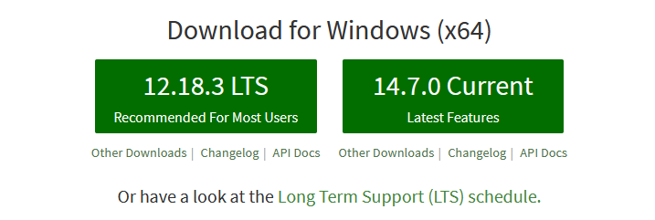
    <br>
</h1>

A primeira se refere à versão do Node que possui Long Term Support (LTS), são as mais confiáveis e é a que recomendamos utilizar na NLW. Já a segunda se refere à versão do Node mais atual e experimental, o que não é recomendada para desenvolvimento ainda.

Escolhida a versão LTS do Node, precisamos decidir o método de instalação. É importante ressaltar que apesar de na tela inicial do Node.js eles recomendarem a forma de instalação direta (famosa janela que só clicamos no Next), iremos utilizar nesse guia os gerenciadores de pacote (exceto Linux). 

Não só pelo fato de facilitar possíveis desinstalações e atualizações do Node, mas também por serem muito úteis para trabalhar com diversos outros pacotes. Pronto dev, agora que já sabemos que iremos instalar a versão LTS do Node.js utilizando um gerenciador de pacote, bora para o passo-a-passo de cada sistema operacional.

<h1 align="center">
    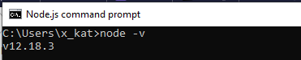
    <br>
</h1>

### Windows

Para o Windows utilizaremos o gerenciador de pacotes [Chocolatey] (https://chocolatey.org/), porém antes dos passos de instalação vamos falar brevemente sobre qual shell você deve usar.
- **CMD**: também conhecido como Command Prompt, ele é um dos shells mais antigos da atualidade (foi construído para ser compatível com o MS-DOS) e, apesar da sua fama, hoje em dia tem sido cada vez menos utilizado.
- **Powershell**: novo shell apresentado pela Microsoft por volta de 2005, ele apresenta diversas melhorias em relação ao CMD, tornando-o popular atualmente e consequemente a nossa escolha para a NLW#02.

### Escolhido o shell:

Busque no campo de busca do Windows por Windows Powershell, clique com o botão direito em cima do programa e escolha a opção “Executar como administrador”. O Powershell trabalha com um esquema de autorizações (conhecido como `Execution Policy`) para execução de scripts e, por isso, precisamos verificar se o presente no sistema está compatível com o que o Chocolatey precisa. Execute o seguinte comando:

```bash
> Get-ExecutionPolicy
```
Caso ele retorne `Restricted`, execute o comando:

```bash
> Set-ExecutionPolicy RemoteSigned
```

E escolha a opção `[A] Sim para Todos. Caso o comando acima apresente erro, tente usar:

```bash
> Set-ExecutionPolicy Bypass -Scope Process
```

Verifique se alteração de permissão ocorreu com sucesso executando novamente o comando:

```bash
> Get-ExecutionPolicy
```

Gerenciador de pacotes vs Gerenciador de dependências
- Um gerenciador de pacotes é uma ferramenta utilizada para instalação, remoção e atualização de programas/pacotes ou software.
- Um gerenciador de dependências é uma ferramenta que permite registrar dependências externas (bibliotecas) que serão utilizadas por nossa aplicação.

### NPM

O npm é um projeto Open Source criado em 2009 com objetivo de facilitar a troca de código JavaScript, sendo usado como gerenciador de pacotes padrão do Node.js. Ao falarmos de npm podemos estar nos referindo a um destes itens:
- O repositório aberto onde ficam armazenados os pacotes
- Um cliente que permite o envio/download de código do repositório
- Um site onde é possível pesquisar informações dos pacotes e ver a documentação do npm.

Também existe uma empresa chamada NPM, Inc., que é a mantenedora do repositório aberto de pacotes e coordena o desenvolvimento do npm. Ela também trabalha no desenvolvimento de soluções pagas focadas no mercado empresarial.

O npm utiliza um arquivo de configuração chamado package.json. Este arquivo é o responsável pela configuração do projeto como o nome,a versão, atalhos de comandos que npm executa, etc. Uma das funções mais importantes é a de armazenar uma lista de dependências que o projeto irá utilizar – se quiser saber mais informações sobre este arquivo e de como realizar a configuração da sua aplicação, clique aqui. Com este arquivo e o cliente do npm é possível instalar todas as dependências com apenas um comando, sendo muito útil quando você precisa executar um projeto em um novo ambiente ou durante a execução de ferramentas de integração contínua.

Mas, e quando o projeto é aquele aerolito monolito, com tantas dependências que você até cogita ver um episódio da sua série favorita enquanto instala? É aí que o Yarn se torna atrativo em comparação ao npm.
Yarn: uma história

Em outubro de 2016, o Facebook lançou o Yarn em conjunto com o Google, Exponent e Tilde, com o objetivo de tornar o processo de instalação das dependências não só mais rápido, mas também mais seguro.

No Facebook, muitos dos projetos que dependiam do npm apresentavam certos problemas, como:
- Demora no tempo de instalação
- Dependência que não possuíam a mesma versão em diversas máquinas
- A forma que o npm executa códigos das dependências de forma automática

Após tentar algumas soluções alternativas para resolver estas questões, alguns engenheiros começaram a trabalhar em um cliente novo, buscando resolver estes problemas a partir da raiz.

Até o lançamento do Yarn, o npm realizava as instalações das dependências de forma não determinística, ou seja, a estrutura da pasta node_modules poderia ser diferente de uma pessoa para outra, causando aquele velho problema do “Mas na minha máquina funciona!”. Para contornar este problema, o Yarn faz uso de arquivos de lock (yarn.lock) e de um algoritmo de instalação determinístico. No arquivo de lock a versão exata da dependência é armazenada, garantindo que todas as instalações são iguais. Apesar de o npm já possuir uma opção para gerar arquivos de lock, o Yarn gera seu arquivo de lock automaticamente. Abaixo o arquivo de lock gerado automaticamente pelo npm e o yarn.

<h1 align="center">
    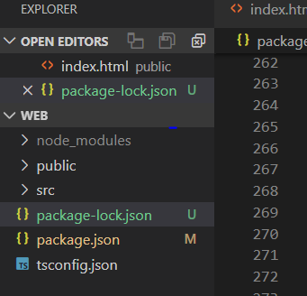
    <br>
</h1>

E no Yarn:

<h1 align="center">
    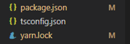
    <br>
</h1>

Para acelerar a instalação, o Yarn consulta um diretório de cache global, que é usado tanto para evitar que o download seja feito, quanto para permitir a instalação enquanto estiver offline, o que não era possível realizar com o npm.

O processo de instalação através do Yarn é feito em três etapas, sendo elas:
- Busca recursiva de dependências no repositório do npm
- Procura no cache global e, caso a dependência ainda não tenha sido baixada, salva uma cópia no cache global
- Conecta as dependências ao copiá-las do cache global para a pasta node_modules local

Desta forma, o Yarn consegue maximizar o uso dos recursos disponíveis e reduzir o tempo de instalação. Em diversos testes de performance realizados após o lançamento do Yarn, ele mostrou-se muito mais rápido que o npm.

Em março de 2017, após um ano e meio de desenvolvimento, foi lançada versão 5 do npm, trazendo diversas melhorias de performance semelhantes às presentes no Yarn. Nesta versão, o npm já cria um arquivo de lock chamado package-lock.json automaticamente; é capaz de instalar dependências a partir do cache; realiza validações de hashes SHA-512 e a velocidade de instalação aumentou cerca de 5x comparada com a anterior. Se você já instalou a versão 8 do Node.js, ela já conta com o npm 5 instalado por padrão.

O melhor de tudo é que tanto o npm quanto o Yarn utilizam o package.json, dando a você a escolha sobre qual melhor se adequa à sua necessidade. Na Umbler não poderia ser diferente, não é mesmo?

Se você usa o npm, não é necessário mais nada. O comando npm install vai ser executado durante o deploy da sua aplicação. Lembrando que se você já usa o Node.js 8, é indicado que você adicione o arquivo package-lock.json no versionamento de código para aproveitar todos os benefícios da nova versão do npm.
Já se você usa o Yarn, é só ter certeza que o arquivo yarn.lock foi adicionado no controle de versão que, durante o deploy, será identificado o uso do Yarn e o comando yarn install será executado.

### Chocolatey (Opcional)

O Chocolatey entra na categoria de gerenciador de pacotes, mais precisamente para sistemas Windows. Por exemplo: caso tente instalar uma ferramenta que possui dependências, tal como o VSCode possui do DotNet, o Chocolatey vai resolver tudo para você! Ele vai lá, baixa a versão correta do DotNet, instala, testa, depois baixa o VSCode, instala, configura e testa para ver se a instalação e configuração ocorreram com sucesso.

Alterada a permissão, basta instalar o Chocolatey com o comando:

```bash
> Set-ExecutionPolicy Bypass -Scope Process -Force; [System.Net.ServicePointManager]::SecurityProtocol = [System.Net.ServicePointManager]::SecurityProtocol -bor 3072; iex ((New-Object System.Net.WebClient).DownloadString('https://chocolatey.org/install.ps1'))
```
<h1 align="center">
    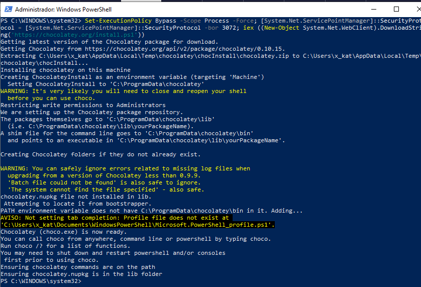
    <br>
</h1>

Após o fim da instalação, feche e abra o Powershell como administrador novamente e execute:

```bash
> choco –v
```

<h1 align="center">
    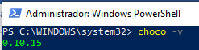
    <br>
</h1>

Caso ele retorne a versão do Chocolatey, a instalação foi um sucesso. Para finalizar, basta instalar a versão LTS mais recente do Node com o seguinte comando:
cinst nodejs-lts

E escolha a opção `[A]ll - yes to all`. Após o fim da instalação, feche e abra o Powershell como administrador novamente e execute:

```bash
> node –v
```
<h1 align="center">
    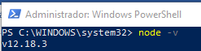
    <br>
</h1>

Caso retorne as versões do Node e npm, sua instalação foi um sucesso. Para atualizar o NodeJS, basta ir ao nodejs.org e fazer o download do instalador mais recente (MSI). 

<h1 align="center">
    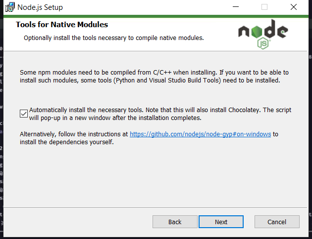
    <br>
</h1>

Para atualizar os pacotes instalados:
```bash
> npm cache clean -f
> npm update npm -g
```
### YARN 1 (Opcional)

Para instalar o Yarn 1 no Windows com o choco siga os seguintes passos, execute o comando no Powershell (como admin):
```bash
> cinst yarn
```

E escolha a opção `[A]ll - yes to all`.  Feche e abra o terminal novamente, em seguida rode o comando:
```bash
> yarn --version
```
<h1 align="center">
    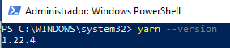
    <br>
</h1>

Caso retorne a versão do Yarn (acima de 1.0, abaixo de 2.0), a instalação ocorreu com sucesso.

EXPO

O Expo é uma ferramenta utilizada no desenvolvimento mobile com React Native que permite o fácil acesso às API’s nativas do dispositivo sem precisar instalar qualquer dependência ou alterar código nativo. Apesar de cumprir esse papel muito bem, o Expo possui algumas desvantagens, principalmente para programadores que estão migrando de um estágio iniciante para intermediário com React Native e por isso vamos analisar todas vantagens do Expo e pontos negativos nesse post.

Quando iniciamos no desenvolvimento mobile percebemos que o número de API’s e recursos nativos que podemos controlar através da nossa aplicação é gigante, e muitas vezes não nos recordamos de todas opções que temos disponíveis. O Expo, por sua vez, oferece grande parte desses recursos de forma nativa e integrada e, por exemplo, você tem acesso à recursos como câmera, microfone, player de música, entre outros, de forma muito simples utilizando essa ferramenta.

Apesar de todos esses benefícios, o grande ponto do Expo para quem está iniciando é que para começar a desenvolver suas aplicações mobile com React Native você não precisará instalar a SDK do Android ou o XCode para Mac, isso porque o Expo possui um aplicativo móvel instalável pelas lojas do Android/iOS que contém todo código nativo necessário pelo React Native para iniciar sua aplicação e, dessa forma, a única alteração em código que você faz é em Javascript.

O ponto destacado acima, na minha opinião, tem dois lados. A vantagem é que nesse formato o desenvolvedor inicia muito rápido e em poucos minutos está criando sua aplicação, toda parte complicada foi abstraída. A desvantagem está em exatamente pular essas etapas pois desconhecendo todo processo de instalação da SDK do Android ou XCode para iOS vai te limitar MUITO futuramente para lidar com processos de atualização e build das aplicações. Utilizar o Expo quando:

- Você está testando o React Native e quer entender como ele funciona;
- Você não tem interesse em publicar e manter aplicações mobile complexas (apenas criar apps simples).

Para instalar o Expo é bem simples e o passo é o mesmo nos 3 sistemas operacionais.  Com o Node e Yarn instalados, abra o terminal (no Windows, sem ser como admin) e execute:
```bash
> yarn global add expo-cli
```

Caso você prefira utilizar o npm, basta executar:
```bash
> npm install expo-cli --global
```

Para verificar se a instalação ocorreu com sucesso, execute:
```bash
> expo –version
```

### Visual Studio Code

Para instalar o editor de texto Visual Studio Code em qualquer um dos 3 sistemas operacionais, basta [acessar o site](https://code.visualstudio.com/), baixar e rodar o executável. Com a instalação finalizada, abra o programa. 

Para finalizar, vamos adicionar algumas configurações no Visual Studio Code. Para isso, basta pressionar `Ctrl + Shift + P` e escolher a opção `Open Settings (JSON). Na janela que foi aberta, adicione as configurações abaixo:

É preciso tomar alguns cuidados ao realizar essas alterações. Verifique se a configuração adicionada já não existe no arquivo. Se sim, apenas atualize o valor.  Verifique também se a todas as linhas de configuração, exceto a última, terminam com vírgula, para não gerar erro.  Por fim, caso queira substituir completamente a sua configuração pela abaixo, envolva com chaves `{}` todo o código disponibilizado.

```bash
  "workbench.startupEditor": "newUntitledFile",
  "explorer.compactFolders": false,
  "editor.renderLineHighlight": "gutter",
  "workbench.editor.labelFormat": "short",
  "extensions.ignoreRecommendations": true,
  "javascript.updateImportsOnFileMove.enabled": "never",
  "typescript.updateImportsOnFileMove.enabled": "never",
  "breadcrumbs.enabled": true,
  "editor.parameterHints.enabled": false,
  "explorer.confirmDragAndDrop": false,
  "explorer.confirmDelete": false,
  "emmet.syntaxProfiles": { "javascript": "jsx" },
  "emmet.includeLanguages": { "javascript": "javascriptreact" },
  "javascript.suggest.autoImports": true,
  "typescript.suggest.autoImports": true,
  "workbench.colorTheme": "Omni"
  "workbench.iconTheme": "material-icon-theme",
```

## CRIAR PROJETO

Depois do Node.js ou Yarn instalado. Execute um dos seguintes comandos:
    * yarn create react-app web --template typescript
    * npx create-react-app web --template typescript

<h1 align="center">
    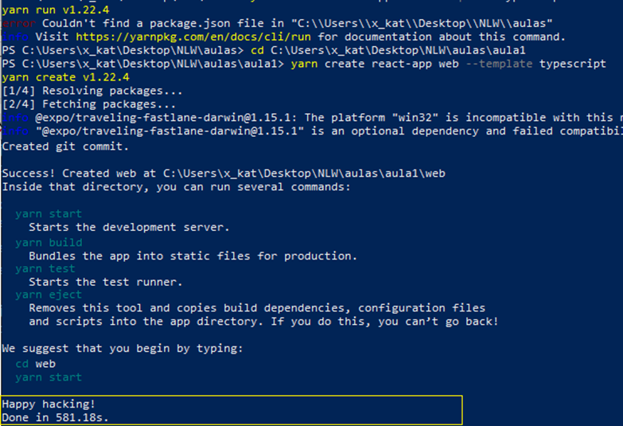
    <br>
</h1>

Esse comando, na minha máquina, durou uns 10 min... Na demonstração demorava 22s. Dependendo da máquina e velocidade de download dos pacotes. Todos os comando yarn podem ser substituídos por um correspondente npm pois o yarn utiliza do npm para funcionar.

Abra o VS Code e habilite o Toggle Terminal (Crtl + ‘ )  

<h1 align="center">
    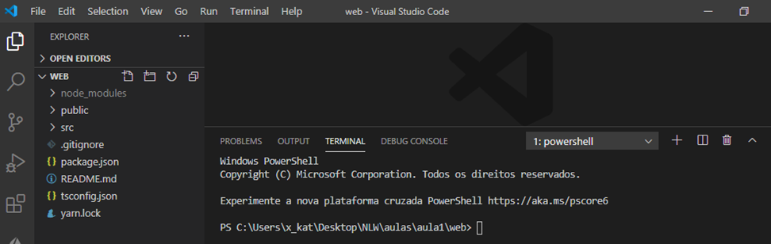
    <br>
</h1>

Inicie o yarn com ou npm:
```bash
> yarn start
```
OU
```bash
> npm start
```

<h1 align="center">
    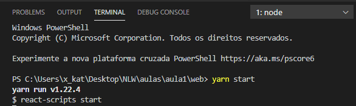
    <br>
</h1>

Caso o projeto tenha sido clonado do GitHub está sem o node_modulos e precisa instalá-los com:
```bash
> npm install
```

<h1 align="center">
    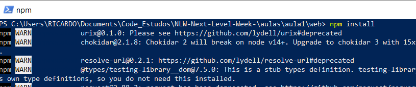
    <br>
</h1>

Vai pedir permissão de acesso pois estará abrindo a aplicação no localhost :3000

<h1 align="center">
    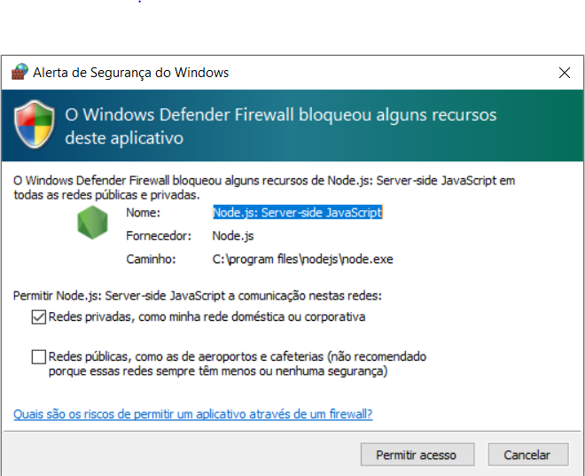
    <br>
</h1>

E já inicia o aplicativo

<h1 align="center">
    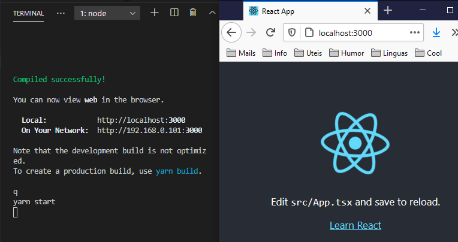
    <br>
</h1>

Para teste remotamente no celular você pode consultar o IPv4 da máquina que está executando indo na linha de comando e digitando:

```bash
> ipconfig
```
<h1 align="center">
    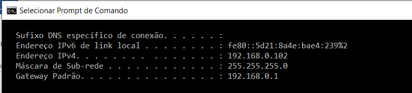
    <br>
</h1>


E no navegador do celular, se estiverem conectados na mesma rede Wifi, digite na URL do navegador o IP e a porta:
```bash
> http://192.168.X.XXX:3000
```

Do template criado pelo React foram apagados os seguintes arquivos do diretório pois não seria utilizados no curso:
- README.md: Arquivo de informações de descrição do projeto no formato Markdown (md) utilizado pelo Git.
- Scr>App.css: Arquivo de estilo de página local (vai ser criado estilo global)
- Scr>index.css: Arquivo de estilo de página local (vai ser criado estilo global)
- Scr>App.test.tsx: Arquivo de Testes.
- Scr>Logo.svg: Image de logo do React.
- Scr>serviceWorker.ts: Usado quando a aplicação é um PWA (Progressive Web App)
- Scr>setupTests.ts: Arquivo de Testes.

Depois da exclusão ocorre alguns erros de referências, mas e só excluí-los e temos uma aplicação limpa para desenvolvimento. Analisando um pouco o arquivo packages.json:

<h1 align="center">
    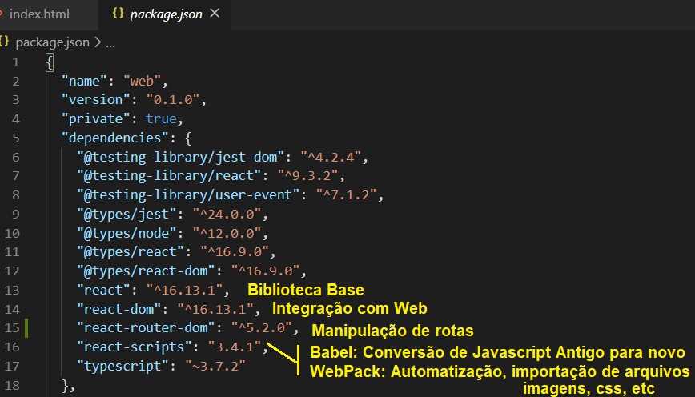
    <br>
</h1>

- **BabelJS** é um transpiler de JavaScript que transpila novos recursos em padrões antigos. Com isso, os recursos podem ser executados em navegadores antigos e novos, sem complicações. Babeljs vem com uma ampla gama de recursos na forma de plug-ins, predefinições, polyfills, etc. Resumindo, Babeljs é um conjunto de ferramentas que possui todas as ferramentas necessárias disponíveis com ele e que ajuda os desenvolvedores a usar todos os recursos atuais disponíveis no ECMA Script e ainda não se preocupam como será suportado nos navegadores.
- **Webpack** é um empacotador de módulo que empacota todos os módulos com dependências - js, estilos, imagens, etc. em ativos estáticos .js, .css, .jpg, .png, etc. Webpack vem com predefinições que ajudam na compilação na forma necessária. Por exemplo, a predefinição de reação que ajuda a obter a saída final na forma de reação, a predefinição es2015 ou env que ajuda a compilar o código em ES5 ou 6 ou 7, etc.

As duas partes principal do projeto são a pasta public e src. No public encontra-se apenas o arquivo index.html foi deixada da seguinte forma:

<h1 align="center">
    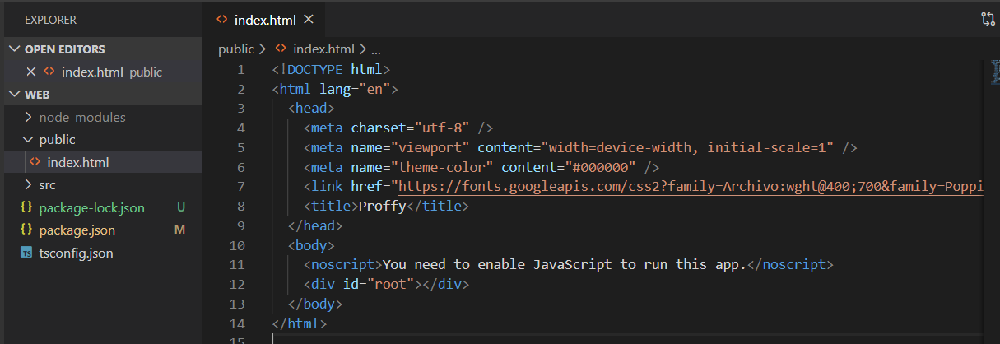
    <br>
</h1>

Apesar de não ter nenhum componente na tag:

```bash
> <div id="root"></div>
```

O React cuida disso, renderizando os componentes a partir do Javascript em tempo de execução. Se o Javascript estiver desabilitado no navegador não aparecerá nada. O arquivo que faz a interface fica no src e se chama index.tsx. O React.StricMode injeta HTML dentro do elemento encontrado pelo método getElement(“root”).

<h1 align="center">
    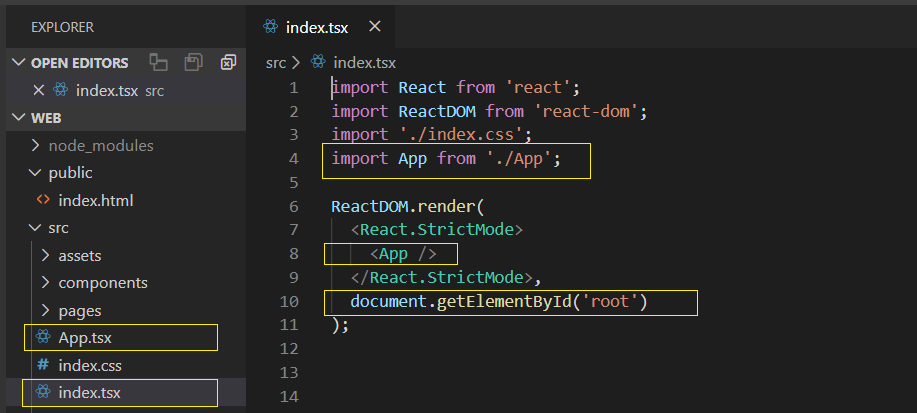
    <br>
</h1>

Nos arquivos extensão TSX (Typescript com XML) coloca-se as funções que irá renderizar os componentes. Um componente é basicamente uma função que retorna/injeta HTML. A sintaxe utilizada é chamada de JSX (Javascript com XML) e é neste arquivo onde ficará os componentes que poderá ser utilizado em várias partes do código.  Note que o nome da função deve estar em maiúscula. Note que se o nome da função fosse em minúscula, o React entenderia como se fosse tag HTML.E de que sempre devemos importar a biblioteca:

```bash
import React from 'react';
```
<h1 align="center">
    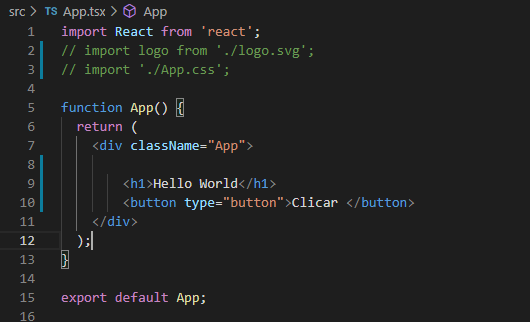
    <br>
</h1>

Crie uma pasta assets dentro de src e coloque a pasta imagens fornecida pelo treinamento. Criado pelo W3C o SVG (Scalable Vectorial Graphics) é nada mais que um arquivo XML que contém tags especificas para gerar uma imagem vetorizada na sua aplicação. Com tags bastante simples você consegue gerar imagens de alta qualidade vetorizadas que por mais que você altere as proporções na tela essa não perderá qualidade, por ser uma imagem vetorizada.

Podendo ser apenas imagem fixa ou animação, o SVG pode ser trabalhado junto ao JavaScript para manipular eventos de imagem. O formato SVG permite três tipos de objetos gráficos, sendo eles imagens, textos ou formas geométricas vetoriais. Crie também uma pasta style e um arquivo global.css. O height 100vh corresponde a sempre 100% da tela.

<h1 align="center">
    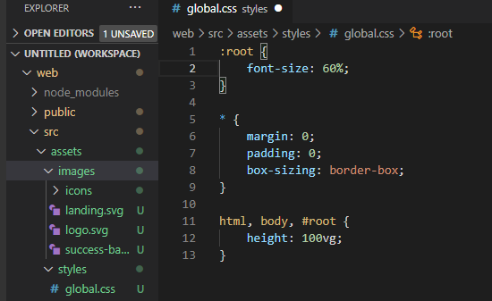
    <br>
</h1>

Para associar fontes ao projeto só precisa ir no site do Google Fonts(https://fonts.google.com/)

<h1 align="center">
    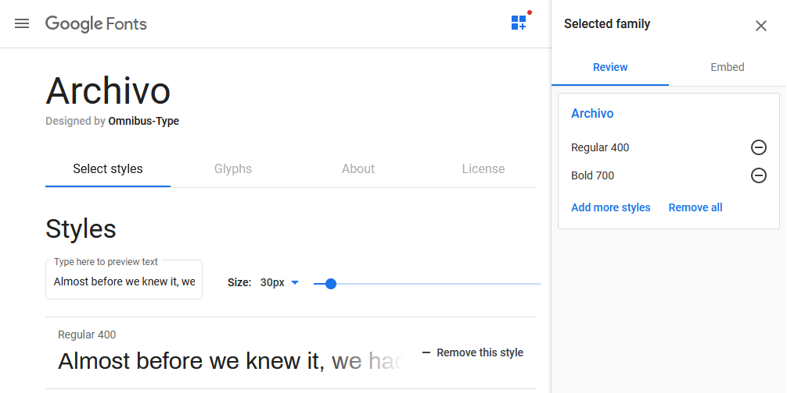
    <br>
</h1>

Depois de selecionar as fontes abaixo, clicamos em Embedd e copiamos o link e colamos em public/indez.html:
- archivo Regular 400
- archivo Bold 700
- poppins Regular 400

<h1 align="center">
    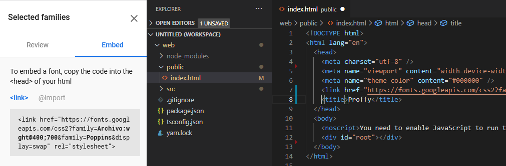
    <br>
</h1>

Depois de incluirmos as fontes podemos definir o tamanho delas responsivo com o unidade de medida rem: 

<h1 align="center">
    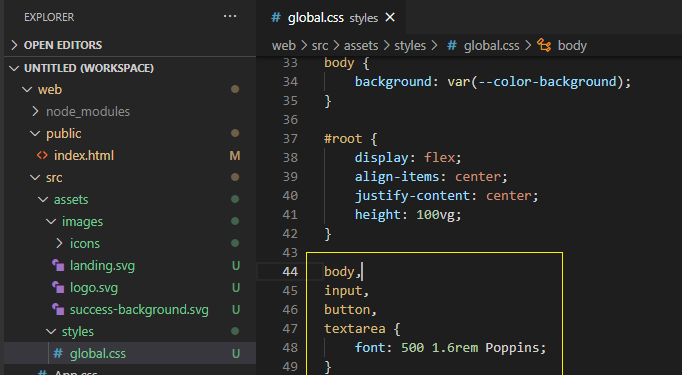
    <br>
</h1>

O 1.6 significa que a fonte desses elementos será 60% maior do que o tamanho padrão da fonte (16px) para dar mais destaque. Esse ajuste é criado, pois como no início do style havia sido definido font-size de 60% (16 x 0.60 = 9.6px). E o rem é utilizado para caso futuramente precisasse aumentar a fonte, só será necessário alterar o valor do root. 

<h1 align="center">
    
    <br>
</h1>

Próximo passo, criamos uma página Landing, e a importamos na página App.tsx, substituindo o html estático com Hello Word e o botão que havia.

<h1 align="center">
    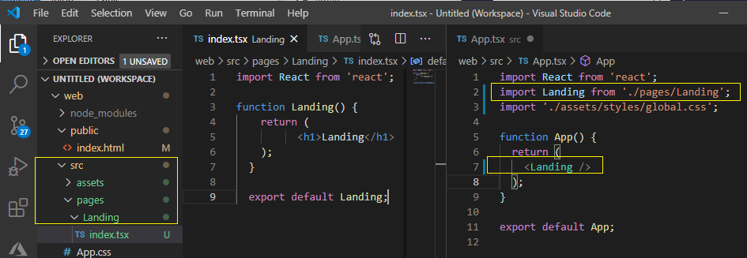
    <br>
</h1>

Repare que a referência de arquivos dentro da aplicação deve estar sempre precedido por ./ ou ../ senão o React confunde com pacotes e não consegue encontrar os arquivos.

<h1 align="center">
    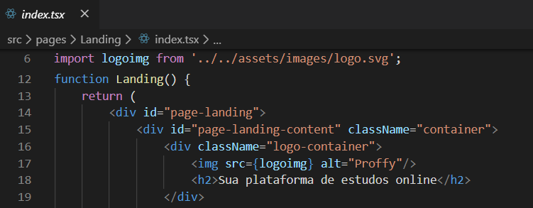
    <br>
</h1>


É possível acelerar a codificação de páginas agora com a sintaxe abreviada Emmet que utiliza com padrões de sintaxe do css para gera o id, class, e outros atributos como uma engenharia reversa:

<h1 align="center">
    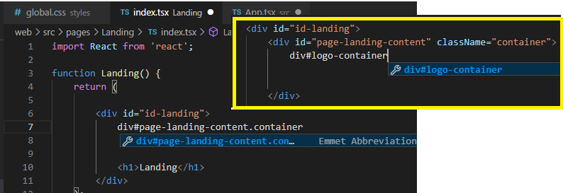
    <br>
</h1>


Essa habilidade foi ativada no início da aula no arquivo settings.json com os parâmetros:
- "emmet.syntaxProfiles": { "javascript": "jsx" },
- "emmet.includeLanguages": { "javascript": "javascriptreact" },

	Se essas configurações não tiverem ativadas você pode ir por Workspace Settings

<h1 align="center">
    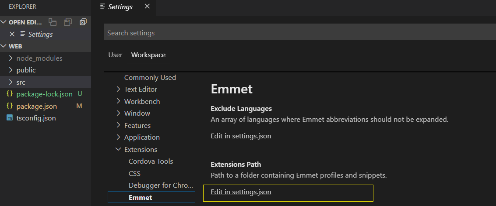
    <br>
</h1>

Repare que as classes são definidas pelo atributo classname e não mais somente com o class. Isso por que o class é palavra reservada no React. Agora para navegar entre páginas temos que instalar:
```bash
yarn add react-router-dom OU npm install react-router-dom
```
<h1 align="center">
    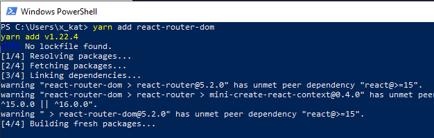
    <br>
</h1>

Incluímos um arquivo routes.tsx para configurar as rotas e na hora de importar emite um aviso para instalar outro pacote, 

<h1 align="center">
    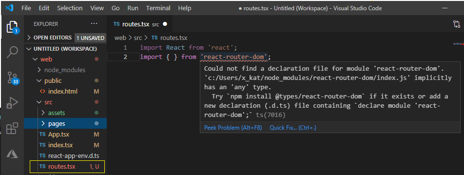
    <br>
</h1>

Colocamos o parâmetro –D para indicar que é uma dependência de desenvolvimento e não vai ser utilizada na produção
```bash
yarn add @types/react-router-dom –D  OU  npm install @types/react-router-dom -D
```

<h1 align="center">
    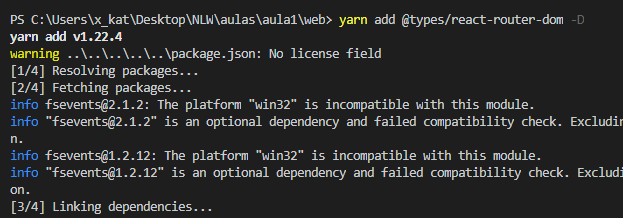
    <br>
</h1>

Depois de instalarmos esse pacote aparece o Inteligesense quando digitamos:

O código da função Routes ficará assim:

<h1 align="center">
    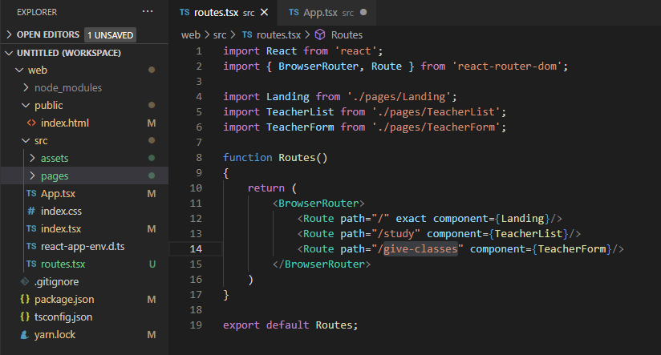
    <br>
</h1>

Repare na primeira rota que navega para raiz tem uma propriedade exact. Isso é para diferenciar das outras rotas que também contém a barra para frente, então a página inicial apareceria em todas as outras páginas. Se alterarmos agora a página inicial App.tsx e a página Landing.tsx as rotas já estarão funcionando.

<h1 align="center">
    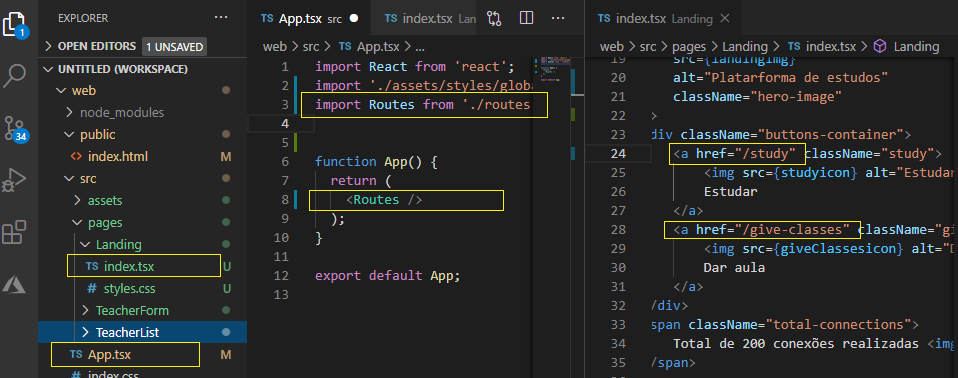
    <br>
</h1>

Porém de formos em Network do browser podemos ver que a cada navegação está havendo o Refresh e carregamento da página inteira (css, scripts) e não queremos isso.

<h1 align="center">
    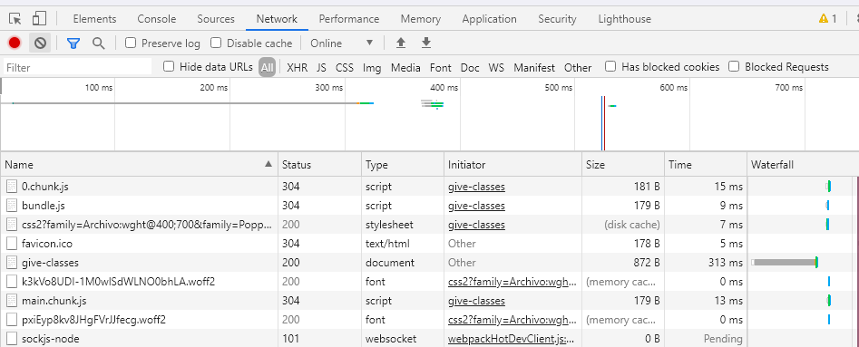
    <br>
</h1>

Para resolver isso temos que importar de react-router-dom o componente Link e substitui-lo pelas anchor tags do HTML.

<h1 align="center">
    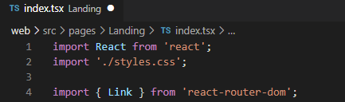
    <br>
</h1>

E invés de href fica to:

<h1 align="center">
    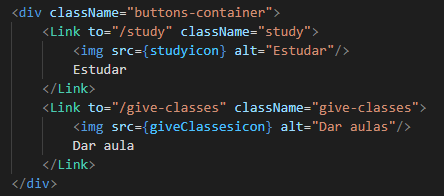
    <br>
</h1>

Ao salvar e testar não está recarregando mais nada ao mudar de página. Esse é o conceito de SPA (Single Page Application). Não tem que ficar recarregando recursos compartilhados da mesma aplicação.

<h1 align="center">
    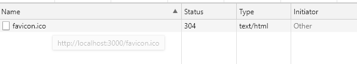
    <br>
</h1>

Um recurso interessante que foi ativado no settings.json no começo dessa aula com os parâmetros:
"javascript.suggest.autoImports": true,
"typescript.suggest.autoImports": true,

Isso ativa a possibilidade de importar as referência de outros objetos enquanto estamos digitando ou clicando na palavra e teclando Ctrl + .(ponto)

<h1 align="center">
    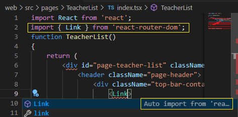
    <br>
</h1>

Para criar um componente é o mesmo processo de criar as páginas:
- Criar a pasta componentes
- Cria-se um folder com o nome do componente
- Cria-se um arquivo index.tsx
- Cria-se um arquivo de estilo local style.css
- Faz as importações de import React from 'react'; import './styles.css';

Uma das diferenças é a criação personalizada de atributos que é feita adicionando uma interface, onde define-se o nome e tipo do atributo, como a seguir:
interface PageHeaderProps 

```bash
interface PageHeaderProps 
{
    title: string;
}

```

Se fosse permitido nulos no parâmetro title teria que colocar um sinal de interrogação após o nome (title?). Além disso, é necessário transformar a função em um objeto constante ficando como abaixo:

<h1 align="center">
    
    <br>
</h1>

O React.FC é uma abreviação de React.FuncionalComponent. As duas formas são aceitas, quando você passa a interface PageHeaderProps está declarando as propriedades que esse componente pode aceitar. Sempre quando se deseja inserir um objeto Javascript dentro do HTML coloca-se em chaves {props} ou {logimg}. O props refere-se a construção lambda, essa denominação é definida pelo programador.

O props.children refere-se a um propriedade que todos os componentes possuem. E significa que tudo que você colocar dentro de um componente será considerado como “children” e será renderizado se você chamar props.children.Na página TeacherList ficaria assim:

<h1 align="center">
    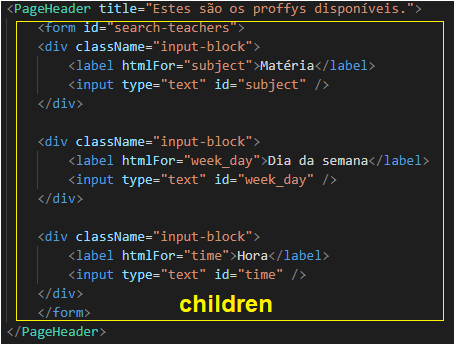
    <br>
</h1>


<h1 align="center">
    
    <br>
</h1>


Para a listagem dos professores foi criado um componente TeacherItem e feita a estilização como abaixo:

<h1 align="center">
    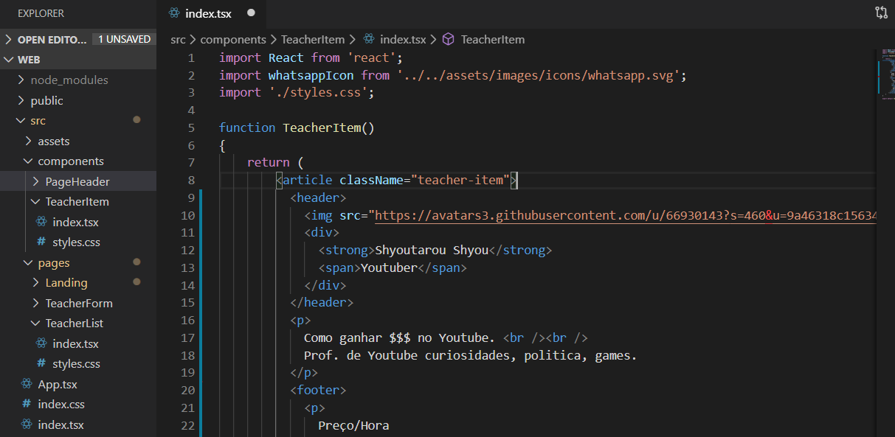
    <br>
</h1>

<h1 align="center">
    
    <br>
</h1>


[Continuar com a Aula 2](Aula02.md)
[Voltar ao README.md](README.md)
    

