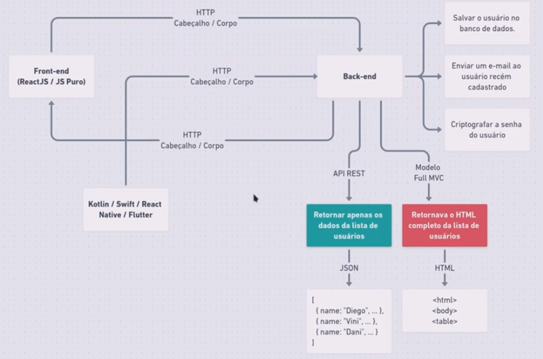

# Aula 2: Proffy-Server

[Voltar as README.md](README.md)

## FLUXO DESENVOLVIMENTO REACT

É explicado o fluxo normal de aplicações, as funções Front e Back-End. A diferença do modelo MVC (carregava tudo a cada Refresh) e o modelo SPA (Single Page Application). Explicado que está se utilizando o Node.js pois permite utilizar a mesma linguagem, Typescript e React, para escrever o Front o Back e o mobile.

<h1 align="center">
    
    <br>
</h1>

Em aplicativos mobile (Kotlin, Swift, React, Flutter), não entendem HTML (body, table, etc.) para facilitar o consumo de dados por este tipo de dispositivos que tornou popular as API REST, pois retornam os dados em formato JSON e a tecnologia do Front-End que constrói o HTML, ele não retorna mais do servidor (modelo MVC). 

### API (Application Programming Interface)

O acrônimo API que provém do inglês trata-se de um conjunto de rotinas e padrões estabelecidos e documentados por uma aplicação A, para que outras aplicações consigam utilizar as funcionalidades desta aplicação A, sem precisar conhecer detalhes da implementação do software.

Desta forma, entendemos que as APIs permitem uma interoperabilidade entre aplicações. Em outras palavras, a comunicação entre aplicações e entre os usuários.

### REST (Representational State Transfer)

REST trata-se de uma abstração da arquitetura da Web. Resumidamente, o REST consiste em princípios/regras/constraints que, quando seguidas, permitem a criação de um projeto com interfaces bem definidas. Desta forma, permitindo, por exemplo, que aplicações se comuniquem.

O HTTP é o principal protocolo de comunicação para sistemas Web, existente há mais de 20 anos, e em todo esse tempo sofreu algumas atualizações. Nos anos 2000, um dos principais autores do protocolo HTTP, Roy Fielding, sugeriu, dentre outras coisas, o uso de novos métodos HTTP. Estes métodos visavam resolver problemas relacionados a semântica quando requisições HTTP eram feitas.

Estas sugestões permitiram o uso do HTTP de uma forma muito mais próxima da nossa realidade, dando sentido às requisições HTTP. Para melhor compreensão, veja os exemplos abaixo (requisições em formatos fictícios):

- **GET** http://www.meusite.com/usuarios
- **DELETE** http://www.meusite.com/usuarios/jackson
- **POST** http://www.meusite.com/usuarios –data {nome: joaquim}

Pela simples leitura  é possível inferir que no primeiro caso estamos pegando (GET) todos os usuários do site, ou seja, teremos uma lista de todos os usuários que estão cadastrados no sistema/site. Já, no segundo caso, estamos apagando (DELETE) o usuário Jackson. No último exemplo, estamos usando o método POST, em que percebemos o envio de dados extras para cadastrar um novo usuário.

Veja o quão simples ficou expressar o que desejamos realizar ao acessar um determinado endereço, usando verbos específicos para URLs específicas e usando dados padronizados, quando necessário.

Estes princípios apresentados fazem parte do REST! Em outras palavras, nesses exemplos, temos: uma representação padronizada, verbos e métodos usados, bem como, URLs.

Existe uma certa confusão quanto aos termos REST e RESTful. Entretanto, ambos representam os mesmo princípios. A diferença é apenas gramatical. Em outras palavras, sistemas que utilizam os princípios REST são chamados de RESTful.
- **REST**: conjunto de princípios de arquitetura
- **RESTful**: capacidade de determinado sistema aplicar os princípios de REST.

Iremos agora criar uma Web API REST. Crie uma pasta server, abra o PowerShell. Para iniciar um projeto, entre na pasta onde o projeto será criado e dê o comando:

```bash
yarn init -y
```

O parâmetro “-y” serve para pular as perguntas iniciais como nome e autor do projeto. Após isso abra o VS Code e foi criado a dependências da aplicação (packages.json)

[Voltar as README.md](README.md)
    