# Aula 2 (04/08/2020): Proffy-Server

[Voltar a Aula 1](Aula01.md)
[Voltar as README.md](README.md)

## FLUXO DESENVOLVIMENTO REACT

É explicado o fluxo normal de aplicações, as funções Front e Back-End. A diferença do modelo MVC (carregava tudo a cada Refresh) e o modelo SPA (Single Page Application). Explicado que está se utilizando o Node.js pois permite utilizar a mesma linguagem, Typescript e React, para escrever o Front o Back e o mobile.

<h1 align="center">
    
    <br>
</h1>

Em aplicativos mobile (Kotlin, Swift, React, Flutter), não entendem HTML (body, table, etc.) para facilitar o consumo de dados por este tipo de dispositivos que tornou popular as API REST, pois retornam os dados em formato JSON e a tecnologia do Front-End que constrói o HTML, ele não retorna mais do servidor (modelo MVC). 

### API (Application Programming Interface)

O acrônimo API que provém do inglês trata-se de um conjunto de rotinas e padrões estabelecidos e documentados por uma aplicação A, para que outras aplicações consigam utilizar as funcionalidades desta aplicação A, sem precisar conhecer detalhes da implementação do software.

Desta forma, entendemos que as APIs permitem uma interoperabilidade entre aplicações. Em outras palavras, a comunicação entre aplicações e entre os usuários.

### REST (Representational State Transfer)

REST trata-se de uma abstração da arquitetura da Web. Resumidamente, o REST consiste em princípios/regras/constraints que, quando seguidas, permitem a criação de um projeto com interfaces bem definidas. Desta forma, permitindo, por exemplo, que aplicações se comuniquem.

O HTTP é o principal protocolo de comunicação para sistemas Web, existente há mais de 20 anos, e em todo esse tempo sofreu algumas atualizações. Nos anos 2000, um dos principais autores do protocolo HTTP, Roy Fielding, sugeriu, dentre outras coisas, o uso de novos métodos HTTP. Estes métodos visavam resolver problemas relacionados a semântica quando requisições HTTP eram feitas.

Estas sugestões permitiram o uso do HTTP de uma forma muito mais próxima da nossa realidade, dando sentido às requisições HTTP. Para melhor compreensão, veja os exemplos abaixo (requisições em formatos fictícios):

- **GET** http://www.meusite.com/usuarios
- **DELETE** http://www.meusite.com/usuarios/jackson
- **POST** http://www.meusite.com/usuarios �data {nome: joaquim}


Pela simples leitura  é possível inferir que no primeiro caso estamos pegando (GET) todos os usuários do site, ou seja, teremos uma lista de todos os usuários que estão cadastrados no sistema/site. Já, no segundo caso, estamos apagando (DELETE) o usuário Jackson. No último exemplo, estamos usando o método POST, em que percebemos o envio de dados extras para cadastrar um novo usuário.

Veja o quão simples ficou expressar o que desejamos realizar ao acessar um determinado endereço, usando verbos específicos para URLs específicas e usando dados padronizados, quando necessário.

Estes princípios apresentados fazem parte do REST! Em outras palavras, nesses exemplos, temos: uma representação padronizada, verbos e métodos usados, bem como, URLs.

Existe uma certa confusão quanto aos termos REST e RESTful. Entretanto, ambos representam os mesmo princípios. A diferença é apenas gramatical. Em outras palavras, sistemas que utilizam os princípios REST são chamados de RESTful.

- **REST**: conjunto de princípios de arquitetura
- **RESTful**: capacidade de determinado sistema aplicar os princípios de REST.

Iremos agora criar uma Web API REST. Crie uma pasta server, abra o PowerShell. Para iniciar um projeto, entre na pasta onde o projeto será criado e dê o comando:

```bash
yarn init -y
```

O parâmetro “-y” serve para pular as perguntas iniciais como nome e autor do projeto. Após isso abra o VS Code e foi criado a dependências da aplicação (packages.json)

<h1 align="center">
    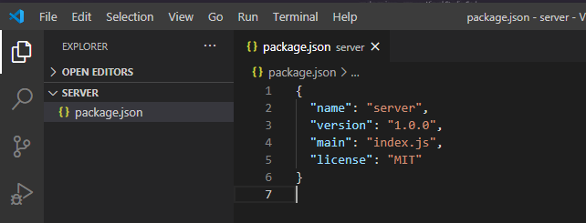
    <br>
</h1>

Crie uma pasta src e um arquivo server.ts

<h1 align="center">
    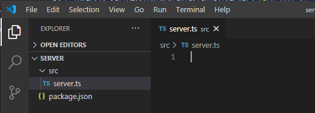
    <br>
</h1>

Abra um terminal no VS Code e instale a biblioteca typescript com o comando:
```bash
yarn add typescript –D
```
<h1 align="center">
    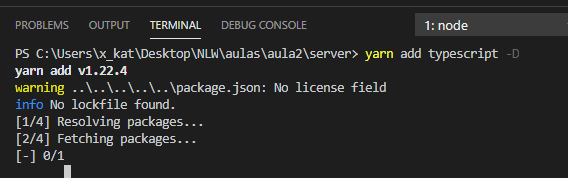
    <br>
</h1>


Gere o arquivo de configuração do Typescript com o comando:
```bash
yarn tsc –init
```
<h1 align="center">
    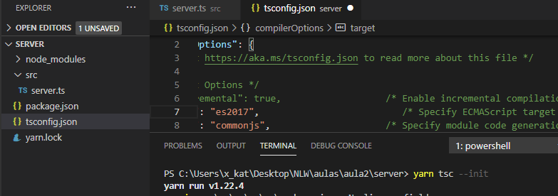
    <br>
</h1>


Definimos a versão do ECMAScript para es2017 pois é a versão que o Node.js entende. Se fosse uma versão de browser como o IE teria que ser uma versão mais antiga. Instalamos a também a dependência:
<h1 align="center">
    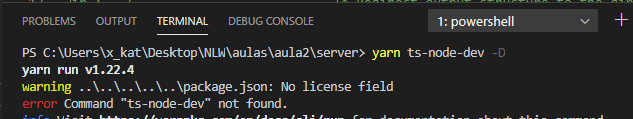
    <br>
</h1>

Que executa o servidor Node, fazendo ele entender Typescript, e monitora se teve alteração no Script. Se houver, ele restart automaticamente o servidor. Por padrão, sem a extensão, teríamos que parar e reiniciar o Node manualmente se houvesse alterações.

Para testar o serviço, altere o arquivo packages.json e crie uma seção scripts e no arquivo server.ts uma mensagem console.log genérica:

<h1 align="center">
    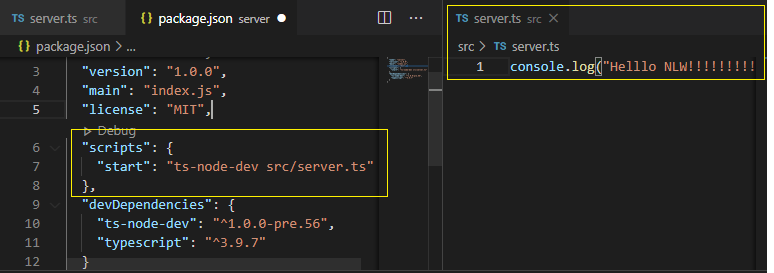
    <br>
</h1>

Observe que esta configuração "start": "ts-node-dev src/server.ts" poderia ser abreviada como "start": "tsnd src/server.ts". Para executar no terminai digite:
```bash
yarn start OU npm start
```
<h1 align="center">
    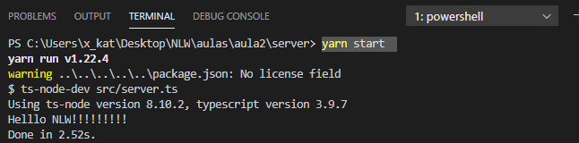
    <br>
</h1>

No script do   iremos inserir algumas flags e ficará assim:

```bash
"scripts": {
    "dev": "tsnd -
            --transpile-only
            --ignore-watch
            --respawn
            src/server.ts",
   },
```
- **transpile-only** Converte Javacript para Typescript, não verifica se tem erros, acelara desenvolvimento
- **ignore-watch** Não converte código dentro da pasta node_modules
- **respawn** Funcionamento de, se alterar o código, faz um restart e continua rodando. Só sai se der Crtl+C

Abaixo um comparativo das saídas de usando o flag respawn, exemplificando que ele continua rodando...

<h1 align="center">
    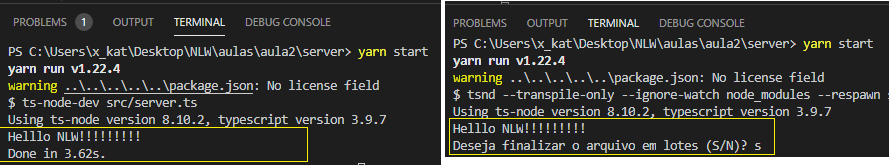
    <br>
</h1>

Outro exemplo é que se alterar a saída, ele atualiza automaticamente:

<h1 align="center">
    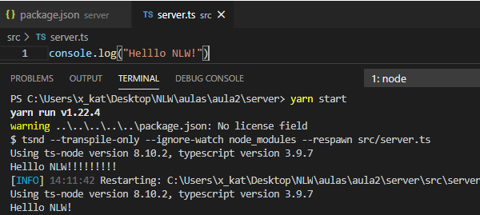
    <br>
</h1>

Por causa dessa funcionalidade temos que abrir outro terminal para instalar outra dependência o express:
yarn add express
```bash
yarn add express
```
<h1 align="center">
    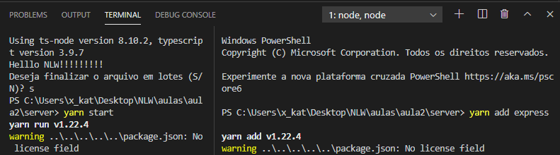
    <br>
</h1>


O express é micro-framework que traz algumas funcionalidades prontas que evitam ficar fazendo configurações. Ao importar o express no arquivo server.ts dá um erro de dependência já visto anteriormente
<h1 align="center">
    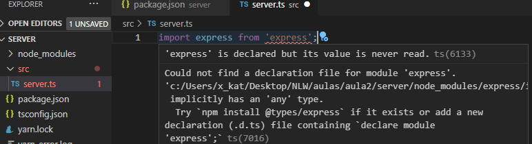
    <br>
</h1>


Quando estamos trabalhando com typescript, alguns pacotes adicionados são também em typescript e outros não. Os que não são a comunidade precisar criar esses pacotes de tipagem (com @type) que precisam ser instaladas também.
```bash
npm install @types/express –D
```
<h1 align="center">
    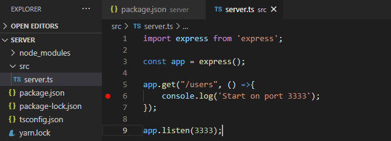
    <br>
</h1>


Executando o método get acima, já temos a comunicação da aplicação mas os resultados não saem no navegador.
<h1 align="center">
    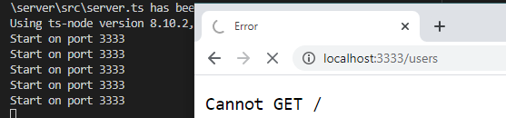
    <br>
</h1>


Para dar a saída temos que incluir os 2 parâmetros que são injetados pelo método app.get: o request e o response. O request traz informações sobre a requisição (o cabeçalho e o corpo, o usuário, e-mail, senha, dados recebidos pelo Front-End). O response é a resposta da API para a aplicação. O código fica assim:

```bash
import express from 'express';

const app = express();

app.get("/users", (request, response) =>{
    return response.send('Start on port 3333 🚀')
});

app.listen(3333);

```
<h1 align="center">
    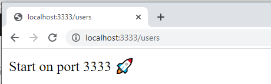
    <br>
</h1>


Porém como trabalhar com formato JSON precisamos fazer algumas alterações:

```bash
import express from 'express';

const app = express();

app.get("/users", (request, response) =>{
    const users =[
        {name: 'Diogo', age:25},
        {name: 'Ana', age:25},
    ]

    return response.json(users)
});

app.listen(3333);
```
<h1 align="center">
    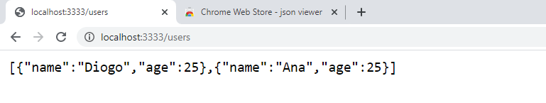
    <br>
</h1>

Para visualizarmos melhor os resultados podemos instalar um plugin no navegador Chrome, JSON Viewer:

<h1 align="center">
    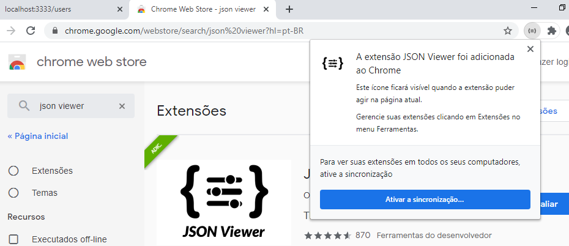
    <br>
</h1>


<h1 align="center">
    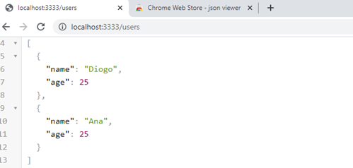
    <br>
</h1>


## Rotas, Recursos e Métodos HTTP

Cada endereço é uma rota (Ex.: http://localhost:3333/users ou http://localhost:3333/contact). O recurso é qualquer coisa que vem depois da URL base, ou seja, /users e /contact são os recursos. Os métodos HTTP de uma API mais comuns são o GET, POST, PUT e DELETE responsáveis pelas operações de CRUD. Como o pacote express que estamos utilizando parece ter limitações(???) quanto as outras requisições que não seja GET vamos utilizar outra ferramenta: O Insomnia Core. E vamo criar um Worksapace para o NLW.
Insonmnia (https://insomnia.rest/download/)

<h1 align="center">
    
    <br>
</h1>


Depois criamos uma nova requisição CriarUsuario pelo método POST:

<h1 align="center">
    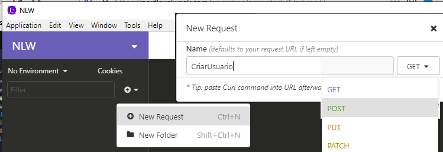
    <br>
</h1>


Depois de alterarmos o método de GET para POST conseguimos obter o resultado desejado:

<h1 align="center">
    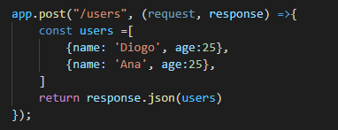
    <br>
</h1>

<h1 align="center">
    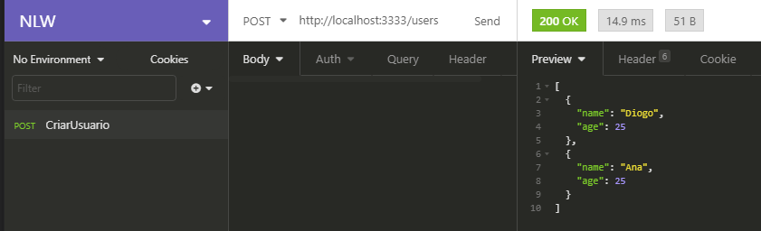
    <br>
</h1>


[Voltar a Aula 1](Aula01.md)
[Continuar a Aula 3](Aula03.md)
[Voltar as README.md](README.md)
    