# Aula 3 (05/08/2020): Front e Back End Web

- [Voltar a Aula 1](Aula01.md)
- [Voltar a Aula 2](Aula02.md)
- [Voltar as README.md](README.md)

## 📌 Index
- [CADASTRO](#cadastro)
    - [TextArea e Caixa de Seleção](#textarea-e-caixa-de-seleção)
- [CONCEITO DE ESTADOS](#conceito-de-estados)
- [INTEGRANDO BACK E FRONT](#integrando-back-e-front)
    - [### GET de Dados](#get-de-dados)
    - [POST no Formulário](#post-no-formulario)
    - [GET Lista de Classes](#get-lista-de-classes)

## CADASTRO

Voltamos ao projeto Front-End, na página Formulário de Cadastro da classe que ficou faltando da aula 1. Como já foi mencionado, é possível criar uma propriedade nula no componente.

<h1 align="center">
    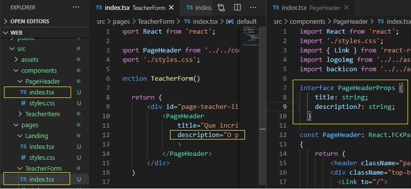
    <br>
</h1>

Para renderizar condicionalmente essa informa��es no componente PageHeader temos duas sintaxe poss�veis:
- **Tern�rio**: {propriedade.description? <p>{propriedade.description}</p> : null}
- **Javacript**: {propriedade.description && <p>{propriedade.description}</p> }

Crie na pasta componentes uma pasta input com os arquivos padr�o index.tsx e styles.css. Para extender todos atributos de um componente padr�o para o seu componente tem que aplicar heran�a (extends) da classe InutHTMLAttributes do React, como abaixo:

<h1 align="center">
    
    <br>
</h1>

Depois recorte e cole a css do input que estava no css da p�gina TeacheList no css desse componente.

<h1 align="center">
    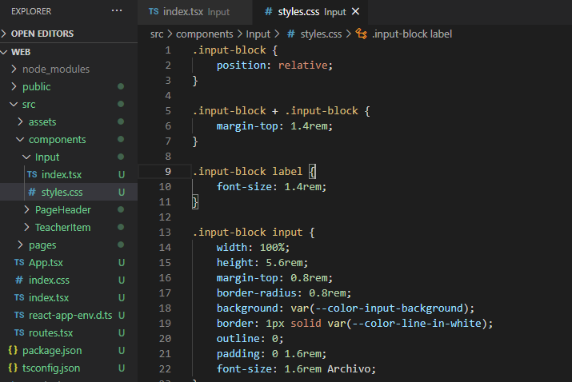
    <br>
</h1>

Importando o componente e substituindo os input da página TeacherList.tsx:

<h1 align="center">
    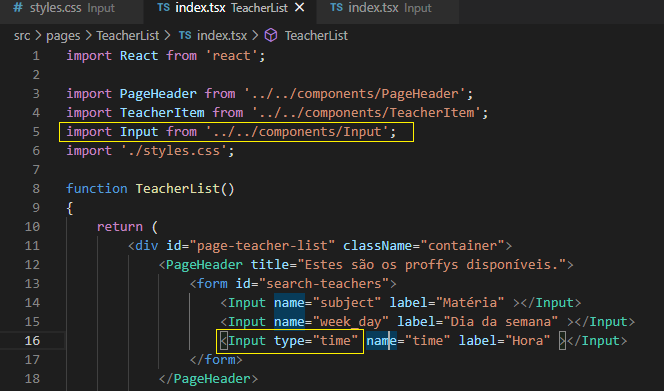
    <br>
</h1>

Testando a herança do componente:

<h1 align="center">
    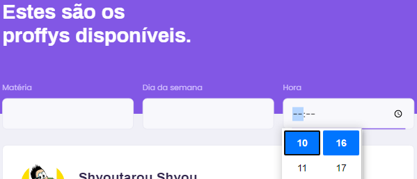
    <br>
</h1>

### TextArea e Caixa de Seleção

	Basicamente, esses dois componentes é o mesmo procedimento do Input, entãom podemos copiar toda a pasta e arquivos e renomeie para o correto. Para renomear múltiplas ocorrências você pode utilizar os atalhos:
- **Crtl + D**: Para ir selecionando uma a uma as ocorrências de um texto selecionado.
- **Crtl + Shift + L**: Para selecionar todas ocorrências de um texto selecionado.

O TextArea teve pequenas mudanças de estilo em relação ao componente Input.

<h1 align="center">
    
    <br>
</h1>

A caixa de seleção poderia ser estilizada usando uma biblioteca externa como o React-Select (https://react-select.com/home):

<h1 align="center">
    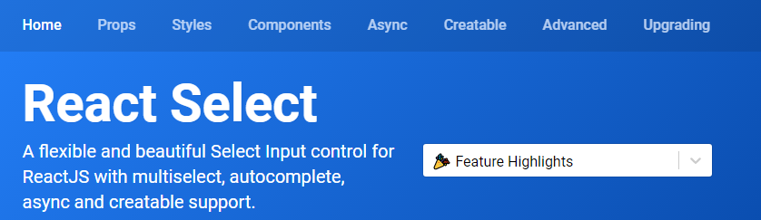
    <br>
</h1>

Para criar os items da caixa de seleção siga o exemplo abaixo no arquivo index.tsx do componente Select

<h1 align="center">
    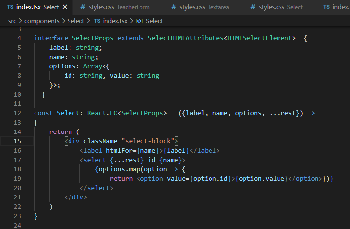
    <br>
</h1>

E na págima TeacherForm.tsx:

<h1 align="center">
    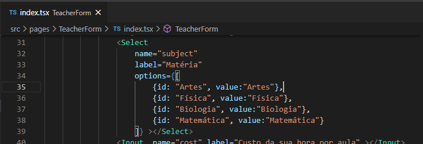
    <br>
</h1>

<h1 align="center">
    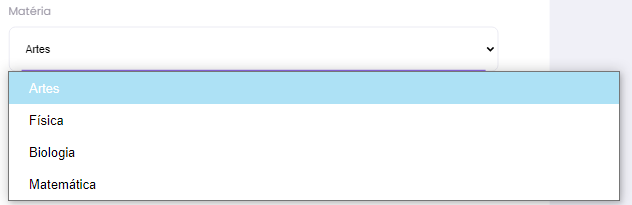
    <br>
</h1>

Porém no Inspect >> Console indica que houve erro:

<h1 align="center">
    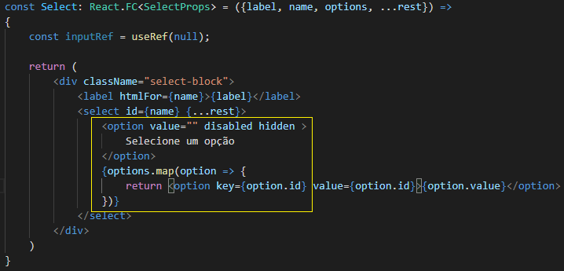
    <br>
</h1>

Isso por que não colocamos o key, que deve ser único para o primeiro elemento da lista. Ajuda o React a identificar os elementos na hora de listar na tela. Foi incluído também um option default.

```bash
<select id={name} {...rest} >
    <option value="" disabled hidden >Selecione um opção</option>
    {options.map(option => {
        return <option key={option.id} value={option.id}>{option.value}</option>
    })}
</select>
```

## CONCEITO DE ESTADOS

	Sempre que precisar manipular um ação dentro de um componente cria-se um estado para manipular o valor. Com o React, diferente do Javascript, estamos criando uma interface declarativa. Principios React no [site](https://reactjs.org/):
- **Declarativo**: O React facilita a criação de UIs interativas. Crie visualizações simples para cada estado do aplicativo e o React atualizará e renderizará com eficiência os componentes certos quando os dados forem alterados. Exibições declarativas tornam seu código mais previsível e mais fácil de depurar.
- **Baseado em componentes**: Crie componentes encapsulados que gerenciam seu próprio estado e os componha para criar UIs complexas. Como a lógica do componente é escrita em JavaScript, em vez de modelos, você pode passar facilmente dados ricos pelo aplicativo e manter o estado fora do DOM.
-  **Aprenda uma vez, escreva em qualquer lugar**: Não fazemos suposições sobre o restante da sua pilha de tecnologia, para que você possa desenvolver novos recursos no React sem reescrever o código existente. O React também pode renderizar no servidor usando o Nó e ativar aplicativos móveis usando o React Native.

No Javascript, para colocar elementos iterativos repetitivos, tinha que inserir HTML (Com algum InnerHTML) para obter o seguinte resultado:

<h1 align="center">
    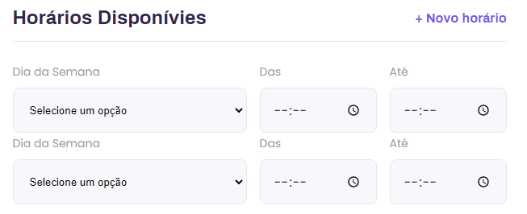
    <br>
</h1>

No React, só precisamos iterar por um array. Porém, o React não fará isso automaticamente por padrão, mas pelo conceito de estados:

```bash
const scheduleItems = [
	{week_day: 0, from: "8:00 AM", to: "16:00 PM"},
    {week_day: 1, from: "10:00 AM", to: "6:00 PM"},
]
```
Repare que sempre que usarmos map na tela, tem que setar a propriedade key. 

<h1 align="center">
    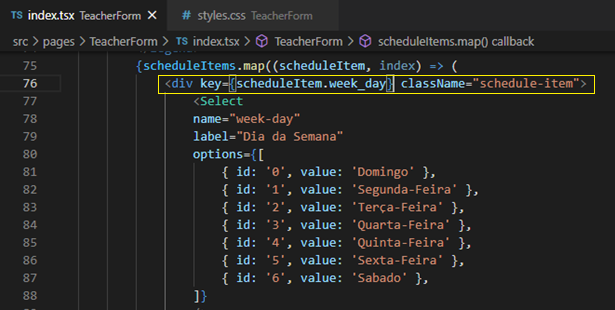
    <br>
</h1>

 Para ativar o estados no React, precisamos importar o módulo, e alterar o array para que aceite os estados, assim:

<h1 align="center">
    
    <br>
</h1>

As variáveis depois que criadas pelo React pelo conceito de estado são imutáveis, por isso foi colocado este formato:

```bash
{ week_day: 0, from: '', to: ''}
```

A função setScheduleItems que o usa para copiar o array:
- A sintaxe Javascript de propagação (Spread) permite que um objeto iterável, como um array ou string, seja expandida em locais onde zero ou mais argumentos (para chamadas de função) ou elementos (para literais de array) sejam esperados ou uma expressão de objeto seja expandida em locais onde zero ou mais pares de chave-valor (para literais de objeto) são esperados.
    - Para chamadas de função: minhaFuncao(...objIteravel);
    - Para array literais: [...objIteravel, 4, 5, 6]
    - Desestruturação: [a, b, ...objIteravel] = [1, 2, 3, 4, 5];

Para recuperar o valor selecionado da caixa de seleção, precisamos atribuir o método Onchange:

<h1 align="center">
    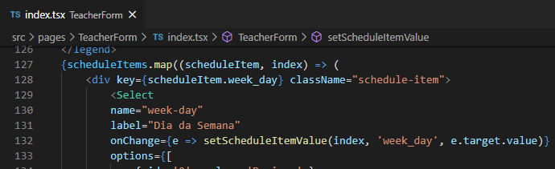
    <br>
</h1>

A função utilizada ficará como a seguir:

<h1 align="center">
    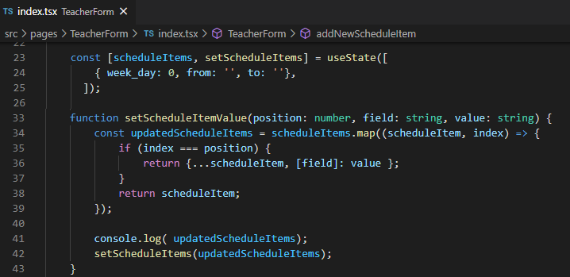
    <br>
</h1>

Que tem o seguinte funcionamento:

```bash
const [scheduleItems, setScheduleItems] = useState([
	{ week_day: 0, from: '', to: ''},
]);
```

Na função setScheduleItemValue(position: number, field: string, value: string), se tiver os valores iniciais como setScheduleItemValue(0, "week_day", '2'), quando passar por scheduleItems.map((scheduleItem, index) terá como valores:

```bash
scheduleItem = { week_day: 0, from: '', to: ''},
index = 0
```

Irá fazer a comparação if (index === position) e, sendo 0 === 0, retorna um objeto array return {...scheduleItem, [field]: value }; O valor de field é "week_day" que vai sobreescrever o valor do campo weekday do objeto array. Testando na aplicação;

<h1 align="center">
    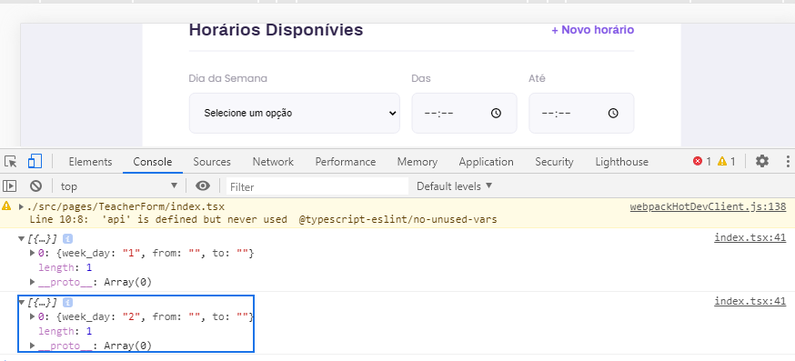
    <br>
</h1>

Porém ao adicionarmos itens aquele problema de key no mapa acontece, pois o índice inicial 0 é repetitdo para cada elemento incluso. É um Issue que precisa ser corrigido.

<h1 align="center">
    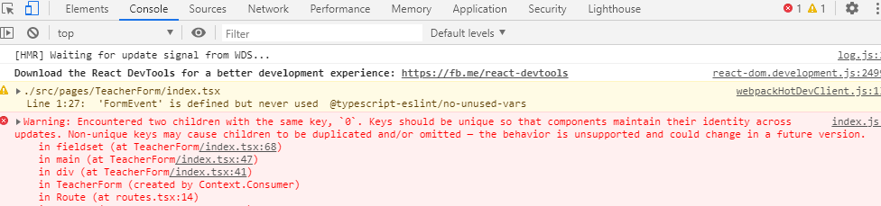
    <br>
</h1>

## INTEGRANDO BACK E FRONT

### Get de dados

	Pelo terminal, navegue até a pasta do projeto server e digite:
```bash
yarn start
```
<h1 align="center">
    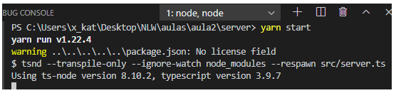
    <br>
</h1>

Às vezes, dá erro ao carregar e não reconhecer o cors e tem que reinstalar. Para confirmar que está funcionando vá ao Insomnia e teste em qualquer dos métodos criado anteriormente:

<h1 align="center">
    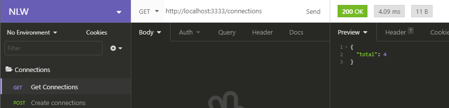
    <br>
</h1>

Precisamos instalar outra biblioteca que facilita o consumo de API externas pela aplicação. Quase todo projeto precisa fazer interface com uma API REST em algum estágio. Axios é um cliente HTTP leve baseado no serviço $ http em Angular.js v1.x e semelhante à API Fetch.

Axios é um cliente HTTP, que funciona tanto no browser quanto em node.js. A biblioteca é basicamente uma API que sabe interagir tanto com XMLHttpRequest quanto com a interface http do node. Isso significa que o mesmo código utilizado para fazer requisições ajax no browser também funciona no servidor. Além disso, as requisições feitas através da biblioteca retornam uma promise, compatível com a nova versão do JavaScript - ES6 e, portanto, podemos aproveitar as vantagens do assíncrono e aguardar por um código assíncrono mais legível. Também podemos interceptar e cancelar solicitações, e há proteção integrada do lado do cliente contra falsificação de solicitação entre sites.
```bash
yarn add axios
```
<h1 align="center">
    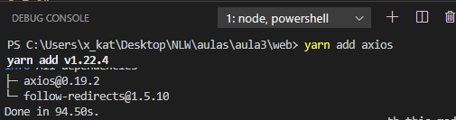
    <br>
</h1>

Criamos uma nova pasta services com um arquivo api.tx com o seguinte código:

<h1 align="center">
    
    <br>
</h1>

Obrigatório colocar o URL de baseURL em maiúsculas e indicar a base do endereço. Vamos adicionar as informações primeiro na página Landing, vamos precisar novamente utilizar dos Estados. Para facilitar a inclusão das referências é possível teclar Crtl + . (ponto):

<h1 align="center">
    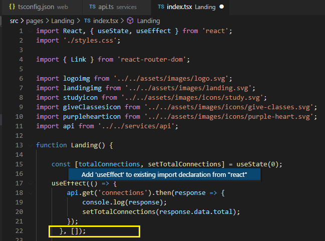
    <br>
</h1>
 
Se quiser que o useEffect atualizasse os valores a cada mudança e não apenas no carregamento da página, teríamos que criar uma variável inclui-la no “Array de Dependências”. Se a variável alterar indica a função quando deve ser executada. O useEffect utiliza o método GET para obter os dados, e se colocássemos um console.log na função poderíamos analisar o retorno:

<h1 align="center">
    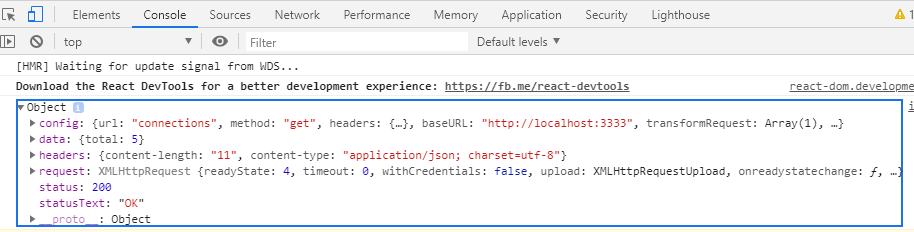
    <br>
</h1>

<h1 align="center">
    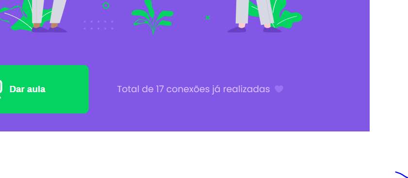
    <br>
</h1>

### POST no Formulário

Na página de TeacherForm.tsx vamos adicionar nossas variáveis de Estado e inicialixa-las:

<h1 align="center">
    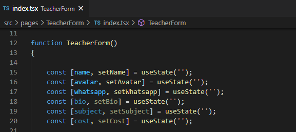
    <br>
</h1>

Depois relacionamos com o campo e adicionamos o método Onchange:

<h1 align="center">
    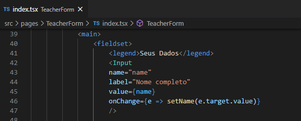
    <br>
</h1>

A seguir, envolvemos todo o código do formulário com uma tag form e trocamos o tipo do botão para submit

<h1 align="center">
    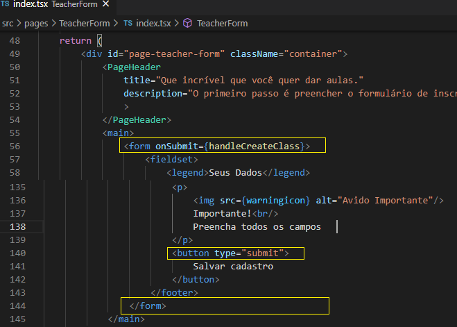
    <br>
</h1>
 
Criamos o método handleCreateClass e para testa-lo emitimos um console.log com os dados da tela. O parâmetro e: FormEvent é necessário pois como a função está fora do HTML, precisamos dessa classe do React para especificar o tipo dos argumentos. O e.preventDefalt é colocado para interromper o POST de direcionamento da página que é o comportamento padrão do botão submit.

<h1 align="center">
    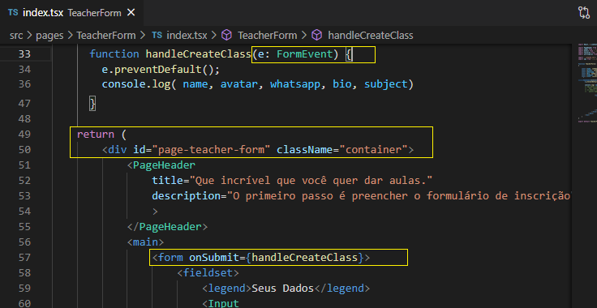
    <br>
</h1>
 
Ao clicar o botão deve voltar os dados:

<h1 align="center">
    
    <br>
</h1>

Quando os dados estiverem retornando, podemos alterar a função para gravar a aula:

<h1 align="center">
    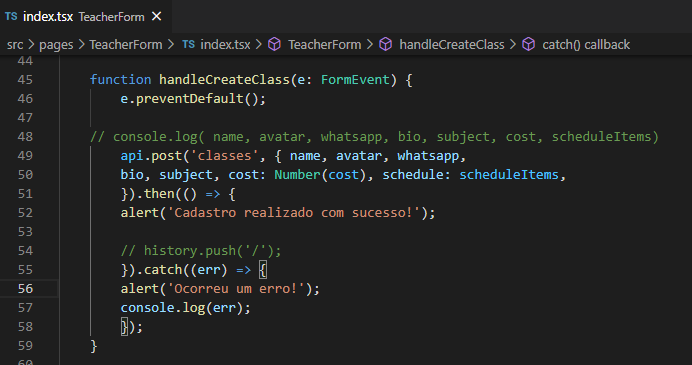
    <br>
</h1>


E verifique se está gravando com o Insomnia e o Request List Classes

<h1 align="center">
    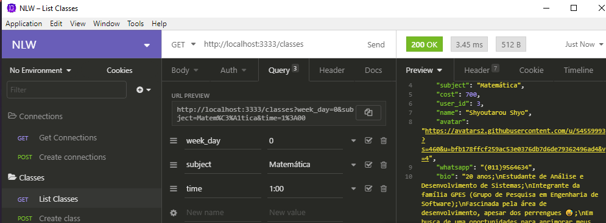
    <br>
</h1>

Para redirecionarmos a página inicial depois de completar o cadastro, precisamos importar o módulo history:

```bash
import { useHistory } from 'react-router-dom';
```

	Criamos uma constante e aplicamos no método.

```bash
const history = useHistory();
```

<h1 align="center">
    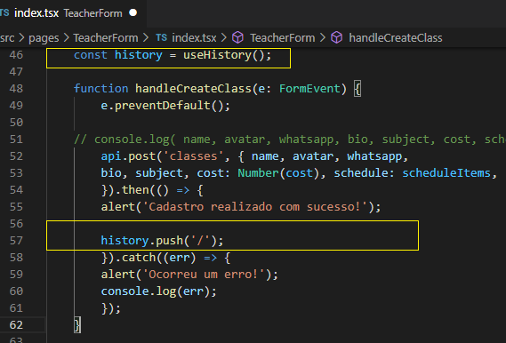
    <br>
</h1>

### GET Lista de Classes

A parte de filtragem é feita da mesma forma que foi feito do POST do formulário, mas até agora os items listados nesta tela TescherList.tsx estão na forma HARD-CODE, ou seja, estático e precisamos trocar por variáveis.

<h1 align="center">
    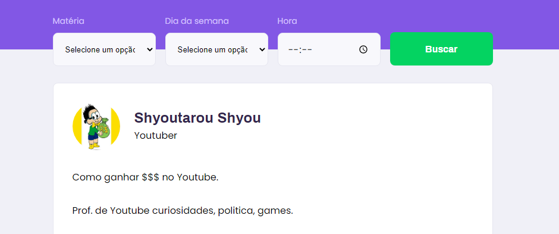
    <br>
</h1>

<h1 align="center">
    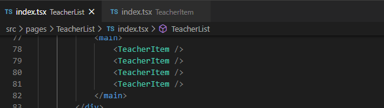
    <br>
</h1>

Para isso precisamos primeiro alterar o componente TeacherItem criando a interface para passar os dados na tela. E também criamos outra interface para definir um objeto, já que as informações que iremos passar não são de tipo primitivo:

<h1 align="center">
    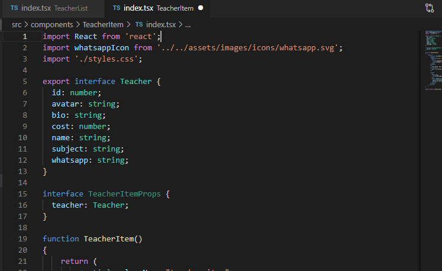
    <br>
</h1>

Lembra-se quando criamos uma interface e precisamos passar os dados, devemos chamar o React.FC é uma abreviação de React.FuncionalComponent, mesma coisa que foi feito no input. E substituímos os campos.

<h1 align="center">
    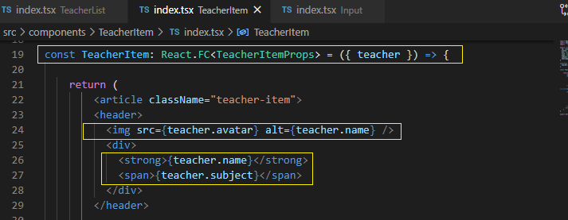
    <br>
</h1>

Por fim, alteramos a página TeacherList.tsx para ficar assim:

<h1 align="center">
    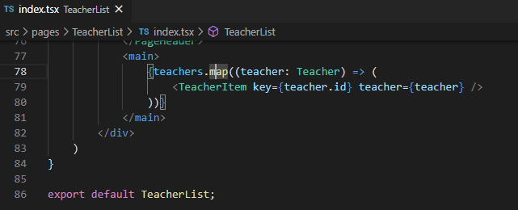
    <br>
</h1>

Ao realizar a filtragem:

<h1 align="center">
    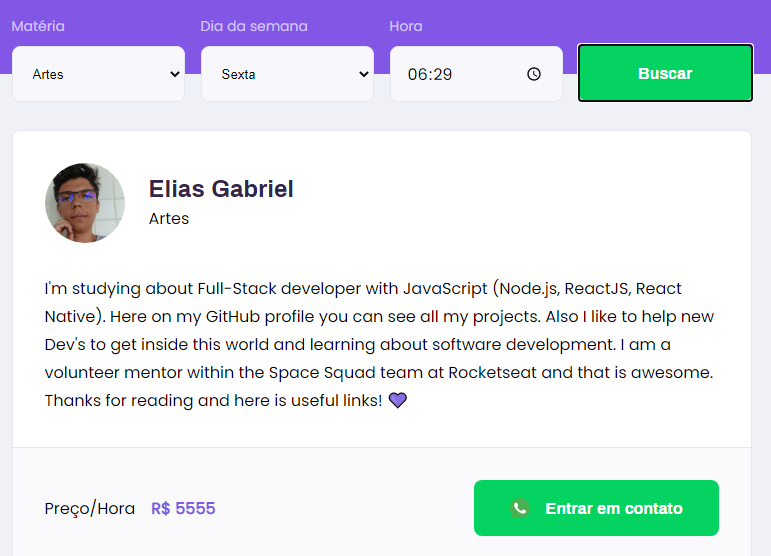
    <br>
</h1>

Por fim, temos que ativar o botão de contato do Whatsapp que utilizará o procedimento “Como usar a conversa em um clique”

Com o recurso conversa em um clique, você pode iniciar uma conversa com alguém cujo número de telefone não está salvo na sua lista de contatos. Desde que você saiba o número de telefone dessa pessoa e que ela tenha uma conta do WhatsApp ativa, você poderá criar um link que permite iniciar uma conversa entre vocês. Ao clicar nesse link, a conversa com essa pessoa será criada automaticamente. A conversa em um clique funciona no seu celular e no WhatsApp Web.
Criar seu link

Utilize https://wa.me/<número> e insira seu número de telefone em formato internacional completo no lugar de <número>. Não é necessário adicionar zero à frente do número, parênteses nem travessões ao inserir o número de telefone em formato internacional.

Exemplos:
- Correto: https://wa.me/552196312XXXX
- Incorreto: https://wa.me/+55(021)96312-XXXX

Ao clicar no botão:


<h1 align="center">
    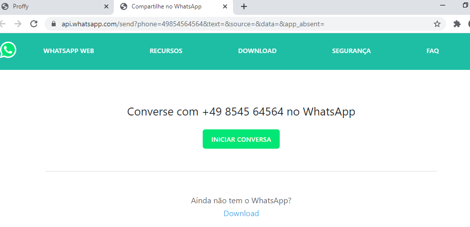
    <br>
</h1>

[Voltar as README.md](README.md)