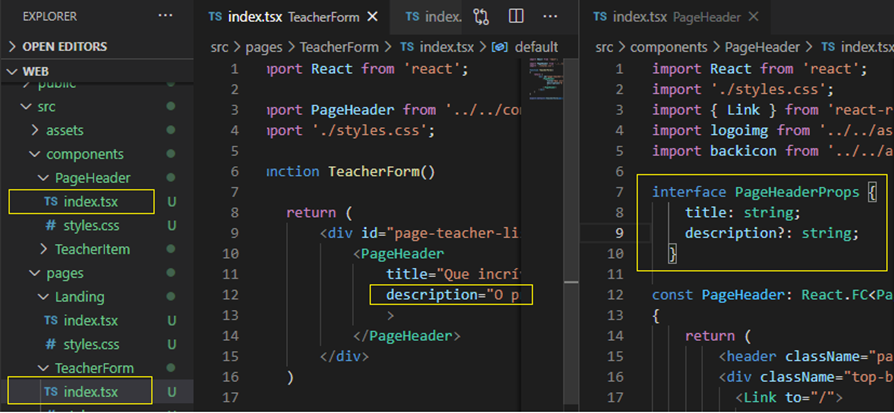
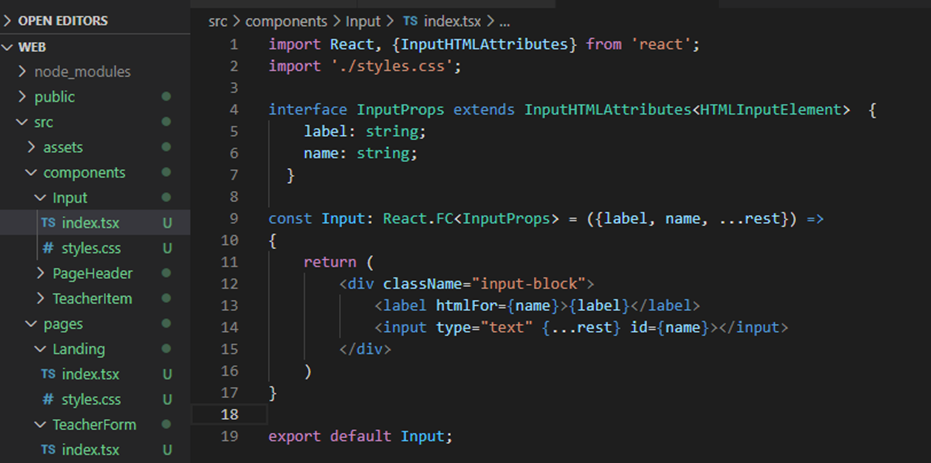

# Aula 3: Finalizando Front-End

[Voltar as README.md](README.md)

## CRIAR PROJETO

Voltamos ao projeto Front-End, na página Formulário de Cadastro da classe que ficou faltando da aula 1. Como já foi mencionado, é possível criar uma propriedade nula no componente.

<h1 align="center">
    
     
</h1>

Para renderizar condicionalmente essa informações no componente PageHeader temos duas sintaxe possíveis:
- **Ternário**: {propriedade.description? 
{propriedade.description}
 : null}
- **Javacript**: {propriedade.description && 
{propriedade.description}
 }

Crie na pasta componentes uma pasta input com os arquivos padrão index.tsx e styles.css. Para extender todos atributos de um componente padrão para o seu componente tem que aplicar herança (extends) da classe InutHTMLAttributes do React, como abaixo:

<h1 align="center">
    
     
</h1>

Depois recorte e cole a css do input que estava no css da página TeacheList no css desse componente.

[Voltar as README.md](README.md)