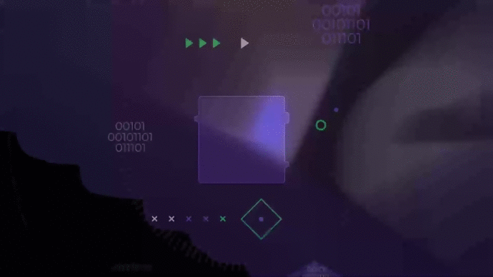

# NLW-Next-Level-Week #2

<h1 align="center">
    
</h1>


<h2 align="center">
  
  
  
  
  
</h2>


## 📌 Index
<p align="center">
  <a href="#-sobre-o-projeto">Sobre o Projeto</a>&nbsp;&nbsp;&nbsp;|&nbsp;&nbsp;&nbsp;
  <a href="#-motivo">Motivo</a>&nbsp;&nbsp;&nbsp;|&nbsp;&nbsp;&nbsp;
  <a href="#-days-e-techs">Days e Techs</a>&nbsp;&nbsp;&nbsp;|&nbsp;&nbsp;&nbsp;
  <a href="#-desenvolvimento">Desenvolvimento</a>&nbsp;&nbsp;&nbsp;|&nbsp;&nbsp;&nbsp;
  <a href="#-screenshots">Screenshots</a>&nbsp;&nbsp;&nbsp;|&nbsp;&nbsp;&nbsp;
  <a href="#-instalação-e-start">Instalação e Start</a>&nbsp;&nbsp;&nbsp;|&nbsp;&nbsp;&nbsp;
  <a href="#-extra-chalenges">Extra chalenges</a> &nbsp;&nbsp;&nbsp;|&nbsp;&nbsp;&nbsp;
  <a href="#-issues">Issues</a>&nbsp;&nbsp;&nbsp;|&nbsp;&nbsp;&nbsp;
  <a href="#-contribuições">Contribuições</a> &nbsp;&nbsp;&nbsp;|&nbsp;&nbsp;&nbsp;
  <a href="#-license">License</a> 
</p>

## ❔ Sobre o projeto

Durante o evento Next Level Week #2, foi desenvolvido a projeto Proffy, que é uma plataforma de estudos online, conectando alunos com professores para aulas online, tendo um calendário para o professro com seus horários disponíveis para que os alunos possam entrar em contato, não engloba vídeo. Trazendo uma representação e homenagem para o dia nacional do profissional da educação, que é comemorado no dia 06 de agosto.

O projeto está sendo desenvolvido na [Next Level Week 2](https://nextlevelweek.com/episodios/omnistack/1/edicao/2). Uma plataforma de estudos online que visa conectar alunos e professores de forma rápida e fácil.

## 🧐 Motivo

Desenvolvimento do projeto Next Level Week, desenvolvido pela Rocketseat.

### ***Utilitários***

- Protótipo: **[Figma](https://www.figma.com/)** &rarr; **<kbd>[Protótipo (Proffy)](https://www.figma.com/file/GHGS126t7WYjnPZdRKChJF/Proffy-Web/duplicate)</kbd>**
- Editor: **[Visual Studio Code](https://code.visualstudio.com/)** &rarr; Extensions: **<kbd>[SQLite](https://marketplace.visualstudio.com/items?itemName=alexcvzz.vscode-sqlite)</kbd>**
- Markdown: **[StackEdit](https://stackedit.io)**, **<kbd>[Markdown Emoji](https://gist.github.com/rxaviers/7360908)</kbd>**
- Commit Conventional: **[Commitlint](https://github.com/conventional-changelog/commitlint)**
- Teste de API: **[Insomnia](https://insomnia.rest/)**
- Ícones: **[Feather Icons](https://feathericons.com/)**, **[Font Awesome](https://fontawesome.com/)**
- Fontes: **[Archivo](https://fonts.google.com/specimen/Archivo)**, **[Poopins](https://fonts.google.com/specimen/Poppins)**

### 🛠 Days e Techs

| Dia | Descriçao | tecnologias |
|:---:|---------|:-----------:|
|  **03/08**  |**Acelerando sua evolução**|    |
|  **04/08**  |**Olhando as oportunidades**|              |
|  **05/08**  |**A escolha da stack**|            |
|  06/08  |Até 2 anos em 2 meses|                |
|  07/08  |A milha extra|   

### Desenvolvimento NLW2_Web wiki!

Resumo dos três primeiros dias da NLW da Rocketseat.

1. [Aula 1](https://github.com/shyoutarou/NLW2_Web/wiki/Aula-1-(03-08-2020):-Proffy-Web)
2. [Aula 2](https://github.com/shyoutarou/NLW2_Web/wiki/Aula-2-(04-08-2020):-Proffy-Server)
3. [Aula 3](https://github.com/shyoutarou/NLW2_Web/wiki/Aula-3-(05-08-2020):-Front-e-Back-End-Web)

## 📸 Screenshots

### Web Responsive Interface  para Desktop com ReactJS
<p align="center">
  
</p>

<h2 align="left"> 📥 Figma layout available for download at: </h2>

- [Instruções](https://www.notion.so/Layout-Proffy-3d5f45f54ec54ef9b2103565b7cce4e1)
- [Protótipo](https://whimsical.com/4Ug5pJLABvCj2NWQXyuK38)
- [Proffy-Web](https://www.figma.com/file/GHGS126t7WYjnPZdRKChJF/Proffy-Web)

## ⚙ Instalação e Start

### Comandos para instalar no MAC

| Tecnologia | Versão | Comando para instalar |
|:----------|------|---------------------|
|NodeJS| 12.18.2| ``` brew install node ``` |
|Yarn  |  1.17.3 | ```npm install -g yarn``` |
|Expo  |  3.23.1 |  ```yarn add global expo-cli```|

### Comandos para instalar no Windows PowerShell

| Tecnologia | Versão | Comando para instalar |
|:----------|------|---------------------|
|Chocolatey| 0.10.15| ```Set-ExecutionPolicy Bypass -Scope Process -Force; [System.Net.ServicePointManager]::SecurityProtocol = [System.Net.ServicePointManager]::SecurityProtocol -bor 3072; iex ((New-Object System.Net.WebClient).DownloadString('https://chocolatey.org/install.ps1')) ``` |
|NodeJS| 12.18.2| ``` choco install nodejs ``` |
|Yarn  |  1.17.3 | ```npm install -g yarn``` |
|Expo  |  3.23.1 |  ```yarn add global expo-cli```|

Certifique-se de que tenha o `Node.js` e um gerenciador de dependências em seu ambiente antes de seguir os passos abaixo.

Para instalar e startar a plataforma Proffy, use `npm` ou `yarn`:

### Clonagem

Primeiro, clone o repositório para seu ambiente:

```bash
> git clone https://github.com/shyoutarou/proffy.git 
```

Depois, entre no repositório clonado e no diretório correspondente ao que quer testar (web, server).
Logo após, insira os seguintes comandos no seu terminal para cada diretório respectivamente:

### Como executar o projeto

Podemos considerar este projeto como sendo divido em três partes:

Back End (pasta server) Front End (pasta web) Mobile (pasta mobile)

💡 Tanto o Front End quanto o Mobile precisam que o Back End esteja sendo executado para funcionar.

### 💻 Executar Projeto Web

```bash
# Entra no diretório "web"
> cd ./proffy/web

# Instala todas as dependências
> yarn install or npm install

# Starta o servidor web para a plataforma Proffy
> yarn start  or npm run start

# Será startado em `http://localhost:3000`
```
### 📦 Executar Server API REST

```bash
# Entra no diretório "server"
> cd ./proffy/server

# Instala todas as dependências
> yarn install or npm install

# Execute migrations
> yarn knex:migrate

# Start o servidor web para a plataforma Proffy
> yarn start  or npm run start

# Será startado em `http://localhost:3333`
```

## Extra chalenges in App Version 2.0

- [x] Autenticação
  - [x] Login / Logout 
  - [x] Permanecer logado - Token
  - [x] Recuperar senha
- [x] Manutenção do Perfil do usuário
- [x] Adicionar e remover os Horários no cadastro das Aulas 
- [ ] Deploy
 
<h2 align="left"> 📥 Figma layout available for download at: </h2>

- [Instruções](https://www.notion.so/Vers-o-2-0-Proffy-eefca1b981694cd0a895613bc6235970)
- [Proffy-Web 2.0](https://www.figma.com/file/Agvethfp7FANyXDDU3LUfd/Proffy-Web-2.0)

## 🐛 Issues

Sinta-se à vontade para registrar um novo problema com o respectivo título e descrição no repositório Proffy. Se você já encontrou uma solução para seu problema, adoraria revisar sua solicitação de pull!

## 🤝 Contribuições

Siga os passos abaixo para contribuir:

1. Faça o *fork* do projeto (<https://github.com/shyoutarou/NLW2_Web.git>)

2. Clone o seu *fork* para sua maquína (`git clone https://github.com/user_name/NLW2_Web.git`)

3. Crie uma *branch* para realizar sua modificação (`git checkout -b feature/name_new_feature`)

4. Adicione suas modificações e faça o *commit* (`git commit -m "Descreva sua modificação"`)

5. *Push* (`git push origin feature/name_new_feature`)

6. Crie um novo *Pull Request*

7. Pronto, agora só aguardar a análise 🚀 

## ***:star2: AGRADECIMENTOS***

<div align=center>
  <table style="width:100%">
    <tr align=center>
      <th><strong>Rocketseat</strong></th>
      <th><strong>diego3g</strong></th>
    </tr>
    <tr align=center>
      <td>
        <a href="https://rocketseat.com.br/">
          
        </a>
      </td>
      <td>
        <a href="https://github.com/diego3g">
          
        </a>
      </td>
    </tr>
  </table>
</div>

## ***:books: REFERÊNCIAS***

- [Autenticação no React Native / ReactJS com Context API & Hooks](https://blog.rocketseat.com.br/autenticacao-no-react-native-reactjs-com-context-api-hooks/)
- [https://blog.rocketseat.com.br/reactjs-autenticacao/](https://blog.rocketseat.com.br/reactjs-autenticacao/)
- [Autenticação JWT no React Native com API REST em NodeJS](https://blog.rocketseat.com.br/autenticacao-react-native-nodejs/) 
- [Iniciando com React Native: Navegação e Autenticação com JWT](https://blog.rocketseat.com.br/react-native-autenticacao/)
- [Tipos de navegação no React Native](https://blog.rocketseat.com.br/navegacao-react-native/)
- [How I set up React and Node with JSON Web Token for Authentication](https://medium.com/@romanchvalbo/how-i-set-up-react-and-node-with-json-web-token-for-authentication-259ec1a90352)
- [React (without Redux) - JWT Authentication Tutorial & Example](https://jasonwatmore.com/post/2019/04/06/react-jwt-authentication-tutorial-example)
- [Scroll infinito no React Native](https://blog.rocketseat.com.br/scroll-infinito-no-react-native/)
- [Deploy NLW](https://www.notion.so/Deploy-NLW-56f2a980c20e41d6b1dd22a4d1348e6e)

## 📜 License

O projeto publicado em 2020 sobre a licença [MIT](./LICENSE) ❤️ 

Made with ❤️ by Shyoutarou

Gostou? Deixe uma estrelinha para ajudar o projeto ⭐
 


